number: "1132254527"

## 1. Цель работы

- Получение навыков правильной работы с репозиториями git.
- Освоение рабочего процесса Gitflow Workflow.
- Изучение семантического версионирования (SemVer) и общепринятых коммитов (Conventional Commits).
- Настройка инструментов для автоматического создания журнала изменений (CHANGELOG.md).

## 2. Порядок выполнения работы и результаты

### 2.1 Подготовка рабочего окружения

#### 2.1.1 Установка необходимого программного обеспечения

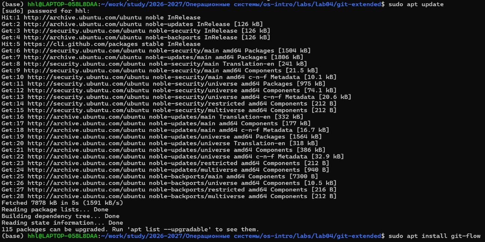

* Команды:

```bash
# Установка git-flow
sudo apt update
sudo apt install git-flow

# Установка Node.js и npm
sudo apt install nodejs npm

# Установка pnpm
sudo npm install -g pnpm
pnpm setup
source ~/.bashrc

# Установка commitizen и standard-changelog
pnpm add -g commitizen standard-changelog

# Установка GitHub CLI
sudo apt install gh
```

Результат: Все необходимые инструменты успешно установлены.

#### 2.1.2 Создание рабочей директории

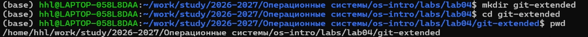

Команды:

```bash
cd /home/sunshengjie/study/2026-2027/Операционные\ системы/os-intro/labs/lab04
mkdir git-extended
cd git-extended
pwd
```

Результат: Создана рабочая директория /home/sunshengjie/study/2026-2027/Операционные системы/os-intro/labs/lab04/git-extended.

### 2.2 Создание и настройка репозитория

#### 2.2.1 Создание репозитория на GitHub

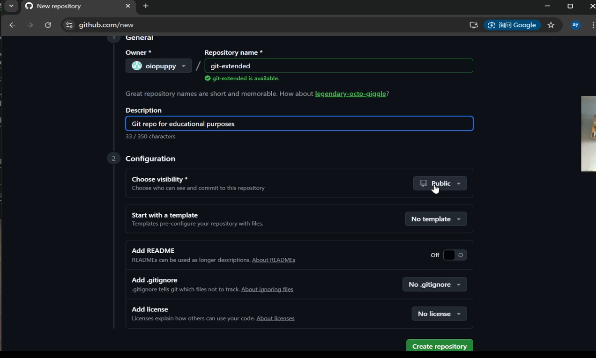

Инструкция: На сайте GitHub создан новый публичный репозиторий с именем git-extended (без инициализации README).

Результат: Репозиторий доступен по адресу git@github.com:oiopuppy/git-extended.git.

#### 2.2.2 Инициализация локального репозитория и первый коммит

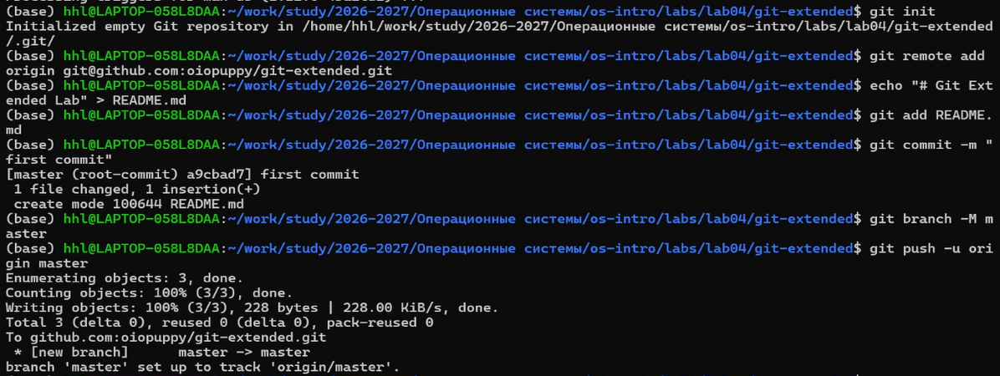

Команды:

```bash
git init
git remote add origin git@github.com:oiopuppy/git-extended.git
echo "# Git Extended Lab" > README.md
git add README.md
git commit -m "first commit"
git branch -M master
git push -u origin master
```

Результат: Локальный репозиторий связан с удалённым, первый коммит отправлен на GitHub.

#### 2.2.3 Настройка Node.js проекта

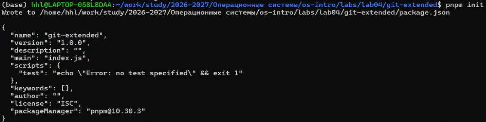

Команда:

```bash
pnpm init
```

Результат: Создан файл package.json с базовой конфигурацией.

#### 2.2.4 Настройка commitizen в package.json

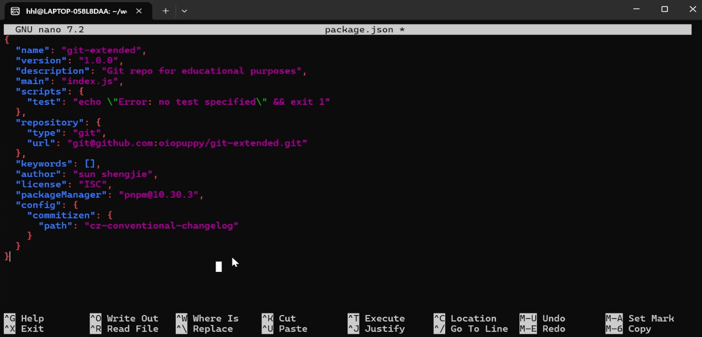

Команда:

```bash
nano package.json
```

Изменения: Добавлена секция config для commitizen и исправлены поля repository, author:

```json
{
  "name": "git-extended",
  "version": "1.0.0",
  "description": "Git repo for educational purposes",
  "main": "index.js",
  "scripts": {
    "test": "echo \"Error: no test specified\" && exit 1"
  },
  "repository": {
    "type": "git",
    "url": "git@github.com:oiopuppy/git-extended.git"
  },
  "keywords": [],
  "author": "sun shengjie",
  "license": "ISC",
  "packageManager": "pnpm@10.30.3",
  "config": {
    "commitizen": {
      "path": "cz-conventional-changelog"
    }
  }
}
```

#### 2.2.5 Первый Conventional Commit

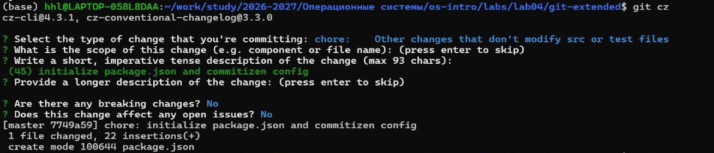

Команды:

```bash
git add package.json
git cz
```

Выбор в интерактивном меню:

Тип: chore  
Область: (пропущено)  
Тема: initialize package.json and commitizen config

Результат: Создан коммит с сообщением, соответствующим спецификации Conventional Commits.

#### 2.2.6 Отправка изменений на GitHub

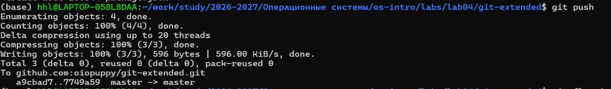

Команда:

```bash
git push
```

Результат: Изменения отправлены в удалённый репозиторий.

### 2.3 Инициализация Gitflow

#### 2.3.1 Запуск git flow init

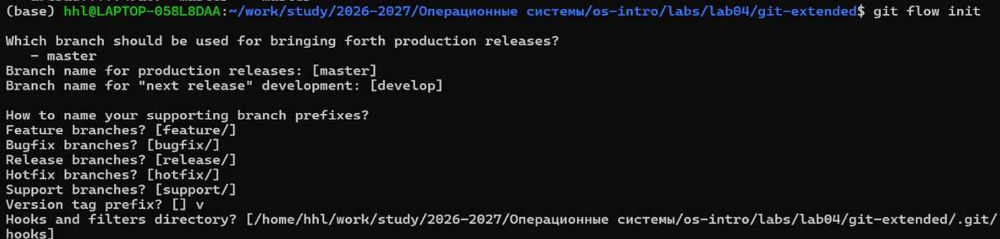

Команда:

```bash
git flow init
```

Настройки:

Ветка для релизов: master  
Ветка для разработки: develop  
Префикс для функциональных веток: feature/  
Префикс для релизных веток: release/  
Префикс для hotfix веток: hotfix/  
Префикс для тегов версий: v

Результат: Gitflow инициализирован, создана ветка develop.

#### 2.3.2 Отправка всех веток на GitHub

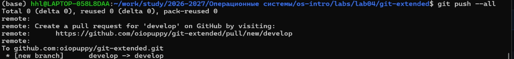

Команды:

```bash
git push --all
git branch --set-upstream-to=origin/develop develop
```

Результат: Ветки master и develop отправлены на GitHub, настроено отслеживание для develop.

### 2.4 Создание первого релиза (v1.0.0)

#### 2.4.1 Создание релизной ветки

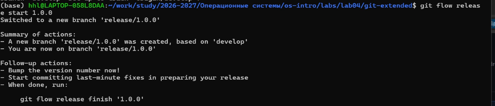

Команда:

```bash
git flow release start 1.0.0
```

Результат: Создана и активирована ветка release/1.0.0.

#### 2.4.2 Генерация CHANGELOG.md

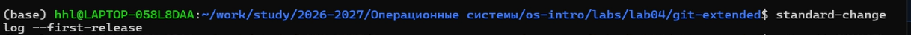

Команда:

```bash
standard-changelog --first-release
```

Результат: Создан файл CHANGELOG.md с историей изменений для первой версии.

#### 2.4.3 Добавление changelog в коммит

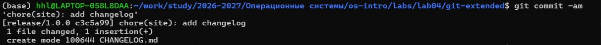

Команда:

```bash
git add CHANGELOG.md
git commit -am 'chore(site): add changelog'
```

Результат: CHANGELOG.md добавлен в релизную ветку.

#### 2.4.4 Завершение релиза

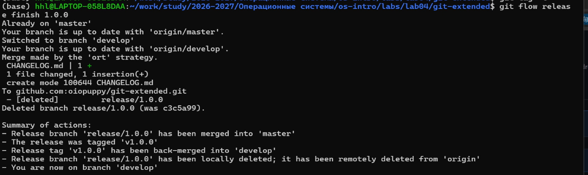

Команда:

```bash
git flow release finish 1.0.0
```

Результат:

Релизная ветка слита в master  
Создан тег v1.0.0 с сообщением "Release 1.0.0"  
Релизная ветка слита обратно в develop  
Релизная ветка удалена

#### 2.4.5 Отправка изменений на GitHub

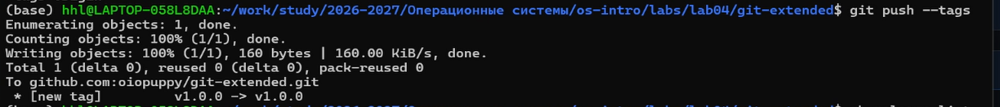

Команды:

```bash
git push --all
git push --tags
```

Результат: Все изменения и тег v1.0.0 отправлены на GitHub.

#### 2.4.6 Создание релиза на GitHub

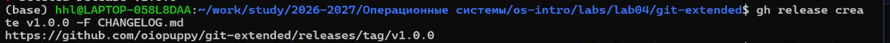

Команды:

```bash
gh auth login
gh release create v1.0.0 -F CHANGELOG.md
```

Результат: На GitHub создан релиз с тегом v1.0.0 и описанием из CHANGELOG.md.

### 2.5 Разработка новой функциональности

#### 2.5.1 Создание feature ветки

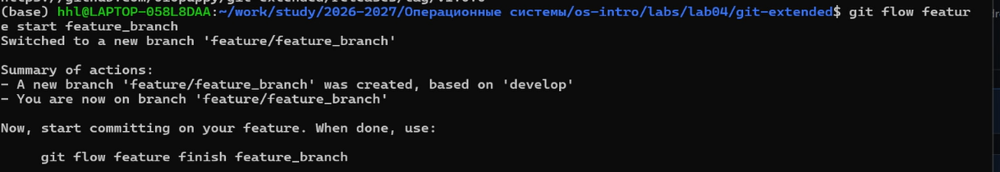

Команда:

```bash
git flow feature start feature_branch
```

Результат: Создана ветка feature/feature_branch для разработки новой функции.

#### 2.5.2 Разработка и коммит новой функции

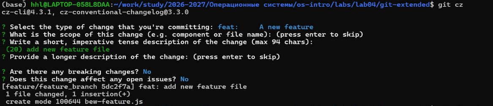

Команды:

```bash
echo "console.log('new feature');" > new-feature.js
git add new-feature.js
git cz
```

Выбор в интерактивном меню:

Тип: feat  
Тема: add new feature file

Результат: Создан файл с новой функцией и закоммичен с типом feat.

#### 2.5.3 Завершение feature ветки

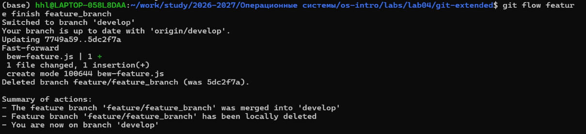

Команда:

```bash
git flow feature finish feature_branch
```

Результат: Feature ветка слита в develop и удалена.

#### 2.5.4 Отправка изменений

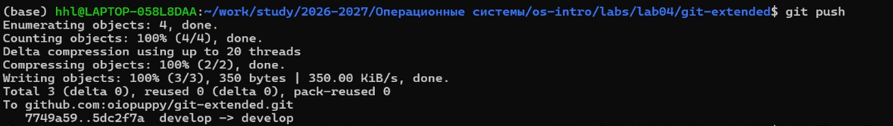

Команда:

```bash
git push
```

Результат: Обновлённая ветка develop отправлена на GitHub.

### 2.6 Создание второго релиза (v1.2.3)

#### 2.6.1 Создание релизной ветки

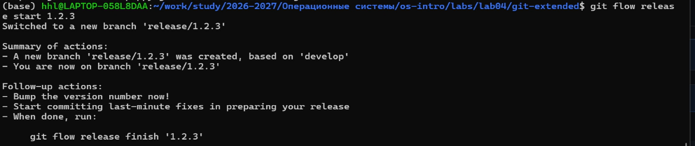

Команда:

```bash
git flow release start 1.2.3
```

Результат: Создана ветка release/1.2.3.

#### 2.6.2 Обновление версии в package.json

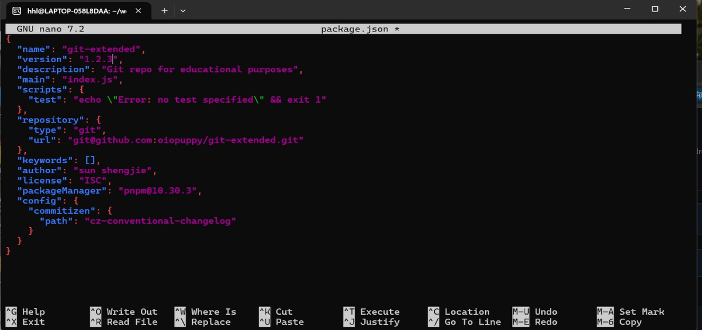

Команда:

```bash
nano package.json
```

Изменение: "version": "1.0.0" → "version": "1.2.3"

#### 2.6.3 Обновление CHANGELOG.md

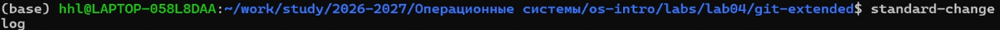

Команда:

```bash
standard-changelog
```

Результат: CHANGELOG.md обновлён, добавлены записи о новой функции.

#### 2.6.4 Коммит изменений

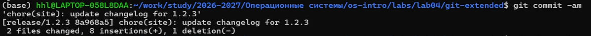

Команда:

```bash
git add package.json CHANGELOG.md
git commit -am 'chore(site): update changelog for 1.2.3'
```

Результат: Изменения закоммичены в релизную ветку.

#### 2.6.5 Завершение релиза

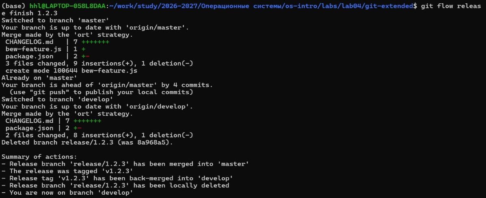

Команда:

```bash
git flow release finish 1.2.3
```

Результат: Создан тег v1.2.3, изменения слиты в master и develop.

#### 2.6.6 Отправка всех изменений на GitHub

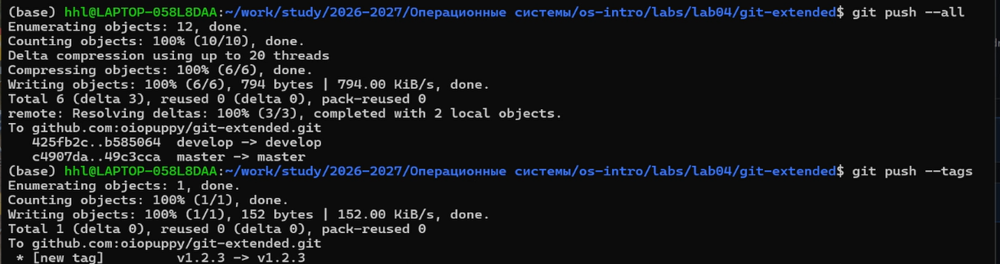

Команды:

```bash
git push --all
git push --tags
```

Результат: Все изменения и тег v1.2.3 отправлены на GitHub.

#### 2.6.7 Создание релиза на GitHub

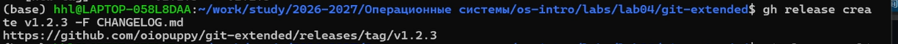

Команда:

```bash
gh release create v1.2.3 -F CHANGELOG.md
```

Результат: На GitHub создан второй релиз с тегом v1.2.3.

### 2.7 Просмотр истории

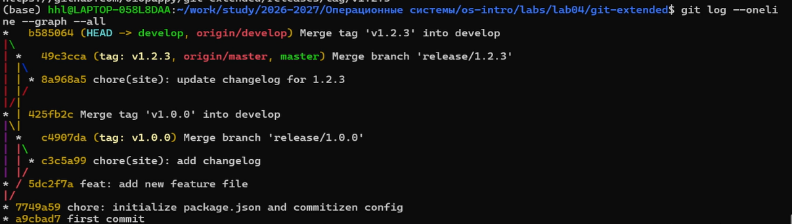

Команда:

```bash
git log --oneline --graph --all
```

Результат: Отображена полная история ветвления слияний, тегов и коммитов.

## 3. Ответы на вопросы для самопроверки

### Что такое Gitflow Workflow и какие основные ветки используются?

Gitflow Workflow — это модель ветвления для Git, опубликованная Винсентом Дриссеном. Она предполагает строгую модель ветвления с учётом выпуска проекта.

Основные ветки:

master — хранит официальную историю релизов  
develop — ветка для объединения всех функций  

Дополнительные ветки:

feature/*  
release/*  
hotfix/*

### Какие типы коммитов определены в спецификации Conventional Commits?

Основные типы:

feat — новая функциональность  
fix — исправление ошибки  
BREAKING CHANGE — несовместимые изменения  
docs — документация  
style — форматирование  
refactor — рефакторинг  
perf — улучшение производительности  
test — тесты  
chore — служебные изменения

Пример:

```
feat(auth): add user login functionality
```

### Что такое семантическое версионирование (SemVer)?

Формат версии:

MAJOR.MINOR.PATCH

MAJOR — несовместимые изменения API  
MINOR — новая функциональность  
PATCH — исправления ошибок

Связь с типами коммитов:

fix → PATCH  
feat → MINOR  
BREAKING CHANGE → MAJOR

### Для чего нужен файл CHANGELOG.md?

CHANGELOG.md содержит историю изменений проекта.

Автоматическая генерация:

```bash
standard-changelog
```

Для первого релиза:

```bash
standard-changelog --first-release
```

### Что делает команда git flow release finish?

Команда:

- сливает релизную ветку в master
- создаёт тег версии
- сливает ветку обратно в develop
- удаляет релизную ветку

### Как создать тег в Git и отправить его?

Создание:

```bash
git tag -a v1.0.0 -m "Release version 1.0.0"
```

Отправка:

```bash
git push --tags
```

## 4. Выводы

В ходе выполнения лабораторной работы я:

- Освоил рабочий процесс Gitflow Workflow
- Изучил семантическое версионирование (SemVer) и Conventional Commits
- Настроил автоматическую генерацию CHANGELOG.md
- Освоил работу с тегами и релизами на GitHub
- Получил практический опыт работы с git-flow, commitizen, standard-changelog и gh
- Понял важность стандартизации коммитов и веток

Все задачи лабораторной работы выполнены в полном объёме.
