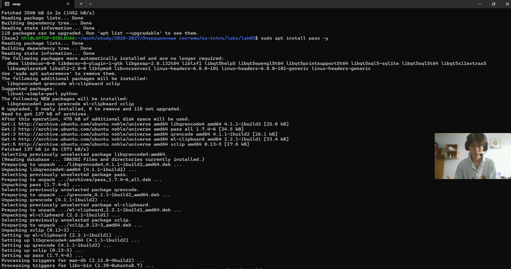
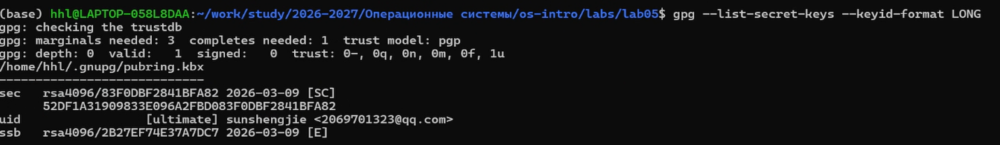
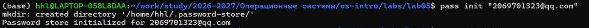
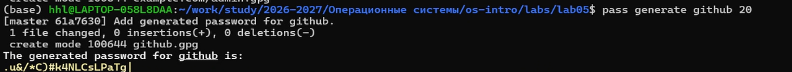
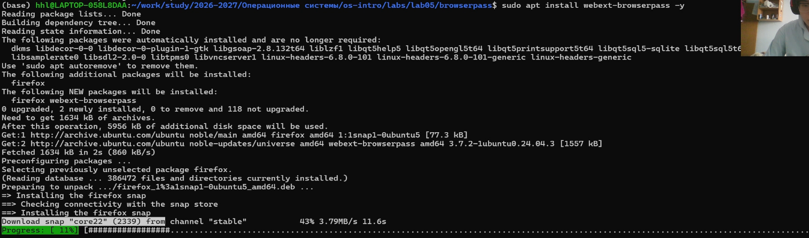
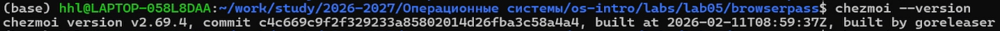
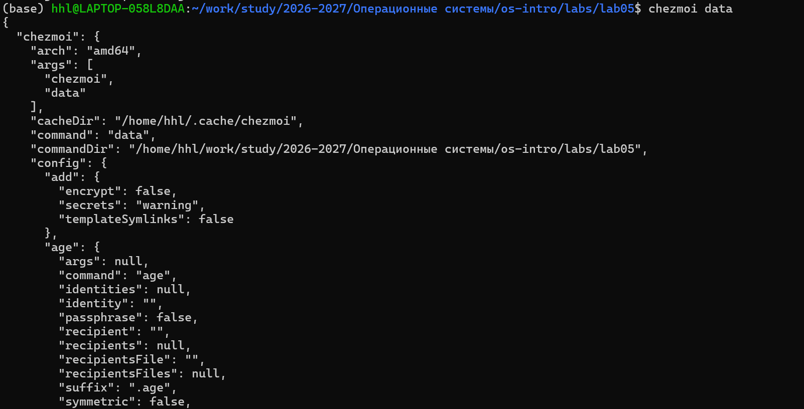
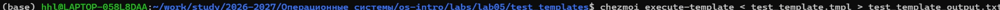
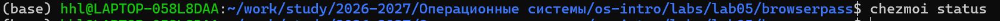

## Цель работы

- Изучение менеджера паролей `pass`
- Получение навыков работы с GPG-ключами
- Освоение семантической структуры базы паролей
- Настройка синхронизации паролей через Git
- Изучение системы управления конфигурациями `chezmoi`
- Освоение работы с шаблонами

## Установка ПО

- **Установка pass**: `sudo apt install pass pass-otp -y`
- **Установка chezmoi**: 
  ```bash
  sh -c "$(wget -qO- get.chezmoi.io)" -- -b ~/bin
  echo 'export PATH=$PATH:$HOME/bin' >> ~/.bashrc
  ```



## Подготовка GPG-ключа

- **Проверка наличия ключей**: `gpg --list-secret-keys`
- **Создание ключа**: `gpg --full-generate-key`



## Инициализация pass

- **Инициализация хранилища**: 
  ```bash
  pass init "sunshengjie@example.com"
  ```



- **Настройка Git синхронизации**:
  ```bash
  pass git init
  pass git remote add origin git@github.com:oiopuppy/password-store.git
  ```

## Работа с паролями

- **Добавление паролей**:
  ```bash
  pass insert example.com
  pass insert work/company-email
  ```



- **Генерация пароля**: `pass generate github 20`
- **Просмотр паролей**: `pass`
- **Копирование в буфер**: `pass -c example.com`

## Настройка browserpass

- **Установка native хоста**: 
  ```bash
  sudo apt install webext-browserpass -y
  ```



- **Установка расширения** в браузере Chrome

## Установка chezmoi

- **Проверка установки**: `chezmoi --version`



- **Инициализация с репозиторием**:
  ```bash
  chezmoi init git@github.com:oiopuppy/dotfiles.git
  ```

## Работа с chezmoi

- **Применение изменений**: `chezmoi apply -v`
- **Просмотр переменных**: `chezmoi data`



## Создание шаблонов

- **Тестовый шаблон**:
  ```bash
  echo 'Имя хоста: {{ .chezmoi.hostname }}' > test.tmpl
  chezmoi execute-template < test.tmpl
  ```



- **Добавление файла как шаблона**: 
  ```bash
  chezmoi add --template ~/.bashrc
  ```

## Ежедневные операции

- **Обновление**: `chezmoi update -v`
- **Редактирование**: `chezmoi edit ~/.bashrc --apply`
- **Статус**: `chezmoi status`
- **Просмотр изменений**: `chezmoi diff`



## Выводы

- Установлен и настроен менеджер паролей `pass`
- Создан GPG-ключ для шифрования паролей
- Настроена синхронизация паролей через Git
- Установлено браузерное расширение browserpass
- Изучена система управления конфигурациями chezmoi
- Освоено создание и тестирование шаблонов
- Выполнены все операции по управлению паролями и конфигурациями
Спасибо за внимание!
