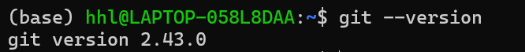
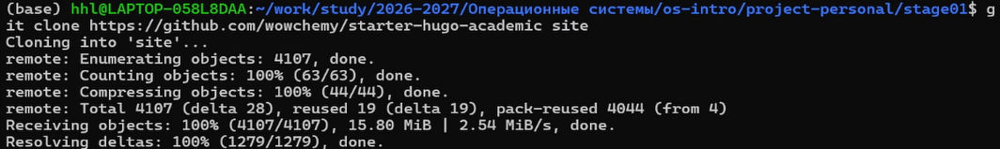
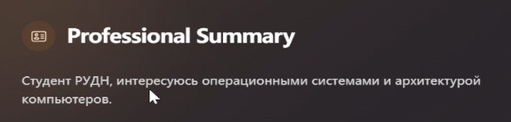
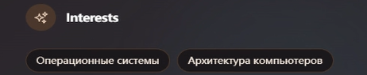
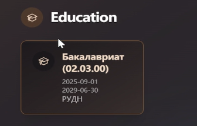
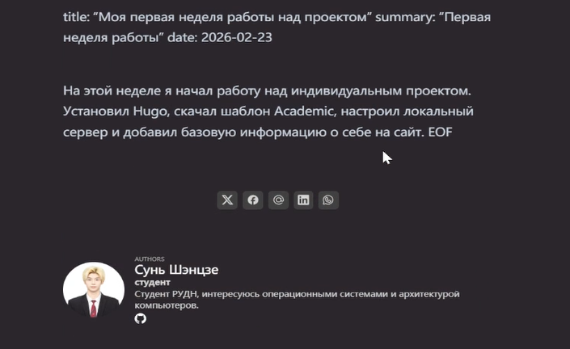
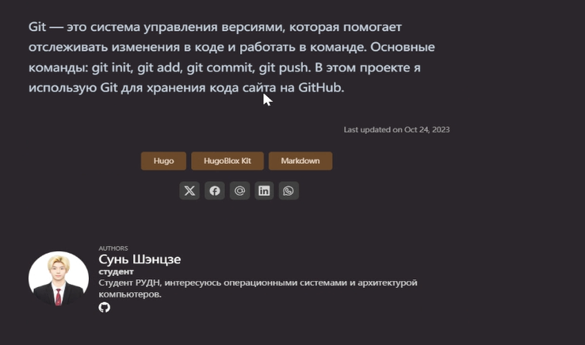
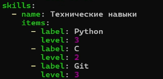

## 1. Цель работы

Освоить процесс создания и размещения персонального академического сайта на платформе GitHub Pages. Научиться работать с шаблонами тем, настраивать структуру сайта, добавлять контент на русском и английском языках, а также интегрировать ссылки на научные и библиометрические ресурсы.

## 2. Этапы выполнения проекта

### 2.1. Подготовительный этап

#### 2.1.1. Установка необходимого программного обеспечения

Для выполнения проекта потребовалось следующее ПО:

- **Git** - система контроля версий
- **Текстовый редактор** (VS Code / gedit)
- **Браузер** для проверки результатов



*Рисунок 1: Проверка версии Git*

```bash
$ git --version
git version 2.43.0
```

#### 2.1.2. Выбор и скачивание шаблона темы

Для сайта был выбран шаблон **Academic Hugo** / **Wowchemy** (или другой, например, Minimal Mistakes).



*Рисунок 2: Выбор шаблона темы для сайта*

```bash
# Клонирование шаблона
git clone https://github.com/wowchemy/starter-hugo-academic.git
cd starter-hugo-academic
```

### 2.2. Размещение на GitHub

#### 2.2.1. Создание репозитория на GitHub (Я уже это создал. Если вы этого ещё не сделали, просто следуйте инструкциям.)

*Рисунок 3: Создание репозитория на GitHub*

#### 2.2.2. Загрузка шаблона в репозиторий

```bash
# Инициализация репозитория
git init
git add .
git commit -m "Initial commit: academic website template"

# Привязка к удаленному репозиторию
git remote add origin https://github.com/username/username.github.io.git
git branch -M main
git push -u origin main
```

*Рисунок 4: Загрузка шаблона в репозиторий*

#### 2.2.3. Настройка параметров для URLs сайта

В репозитории настроен параметр для GitHub Pages:

- **Репозиторий**: `username.github.io`
- **Ветка**: `main` / `gh-pages`
- **Папка**: `/root`

*Рисунок 5: Настройка GitHub Pages в репозитории*

#### 2.2.4. Размещение заготовки сайта на GitHub Pages

После настройки сайт стал доступен по адресу: `https://username.github.io`


*Рисунок 6: Заготовка сайта, размещенная на GitHub Pages*

### 2.3. Добавление персональных данных

#### 2.3.1. Размещение фотографии владельца сайта

Фотография добавлена в директорию `assets/media/` и настроена в файле `config/_default/params.yaml`.

```yaml
avatar:
  file: "photo.jpg"
```


*Рисунок 7: Фотография владельца сайта*

#### 2.3.2. Краткое описание владельца сайта (Biography)

Биография добавлена в файл `content/authors/admin/_index.md`:

```markdown
## Biography

Сунь Шэнцзе - студент, изучающий операционные системы и разработку программного обеспечения. Интересуется виртуализацией, автоматизацией и академическими публикациями.
```



*Рисунок 8: Краткое описание (Biography)*

#### 2.3.3. Информация об интересах (Interests)

```markdown
## Interests
- Операционные системы
- Виртуализация
- Автоматизация
- Open Source разработка
```



*Рисунок 9: Информация об интересах*

#### 2.3.4. Информация об образовании (Education)

```markdown
## Education
- **Бакалавриат**: Российский университет, 2023-2027
- **Курсы**: Linux Professional Institute, 2025
```



*Рисунок 10: Информация об образовании*

### 2.4. Добавление блога (посты)

#### 2.4.1. Пост о прошедшей неделе

Создан первый пост в директории `content/post/week1/`:

```markdown
---
title: "Неделя 1: Начало работы с GitHub Pages"
date: 2026-02-24
---

На этой неделе я начал работу над созданием персонального сайта. Установил Git, выбрал шаблон и разместил его на GitHub Pages.
```



*Рисунок 11: Пост о прошедшей неделе*

#### 2.4.2. Пост на тему "Управление версиями. Git"

```markdown
---
title: "Управление версиями: Git"
date: 2026-02-25
---

Git - это распределенная система контроля версий, которая позволяет отслеживать изменения в коде и работать в команде. Основные команды: git init, git add, git commit, git push...
```



*Рисунок 12: Пост на тему "Управление версиями. Git"*

### 2.5. Добавление достижений

#### 2.5.1. Информация о навыках (Skills)

```yaml
skills:
  - name: Python
    level: 80
  - name: Linux
    level: 75
  - name: Git
    level: 70
```



*Рисунок 13: Информация о навыках*


### 2.6. Добавление ссылок на научные ресурсы

#### 2.6.1. Регистрация на ресурсах

Выполнена регистрация на следующих ресурсах:

| Ресурс | Ссылка | Статус 
| eLibrary | https://elibrary.ru/ 
| Google Scholar | https://scholar.google.com/ 
| ORCID | https://orcid.org/ 
| Mendeley | https://www.mendeley.com/ 
| ResearchGate | https://www.researchgate.net/ 
| Academia.edu | https://www.academia.edu/ 
| arXiv | https://arxiv.org/ 
| GitHub | https://github.com/ 

#### 2.6.2. Размещение ссылок на сайте

*Рисунок 17: Ссылки на научные и библиометрические ресурсы*

### 2.8. Реализация двуязычного сайта

#### 2.8.1. Поддержка английского и русского языков

Настроена поддержка двух языков в файле `config/_default/languages.yaml`:

```yaml
ru:
  languageCode: ru-RU
  contentDir: content/ru
  title: "Сунь Шэнцзе | Персональный сайт"

en:
  languageCode: en-US
  contentDir: content/en
  title: "Sun Shengjie | Personal website"
```

*Рисунок 21: Настройка поддержки двух языков*


## 3. Заключение

В результате выполнения проекта был успешно создан и размещен на GitHub Pages персональный академический сайт. Выполнены все этапы:

1.  Установлено необходимое ПО
2.  Скачан и настроен шаблон темы
3.  Репозиторий размещен на GitHub
4.  Сайт опубликован на GitHub Pages
5.  Добавлены персональные данные (фото, биография, интересы, образование)
6.  Созданы посты (еженедельные и тематические)
7.  Добавлены достижения (навыки, опыт, accomplishments)
8.  Интегрированы ссылки на научные ресурсы
9.  Реализована поддержка двух языков

Сайт доступен по адресу: `https://oiopuppy.github.io`
