**Номер студента:** 1132254527

## 1. Цель работы

-   Изучение менеджера паролей `pass`, работающего в рамках идеологии Unix.
-   Получение навыков работы с GPG-ключами для шифрования паролей.-   Освоение семантической структуры базы паролей.
-   Настройка синхронизации паролей через Git.
-   Изучение системы управления конфигурационными файлами `chezmoi`.
-   Освоение работы с шаблонами для управления конфигурациями на разных машинах.

## 2. Порядок выполнения работы и результаты

### 2.1 Подготовка рабочего окружения

#### 2.1.1 Установка необходимого программного обеспечения


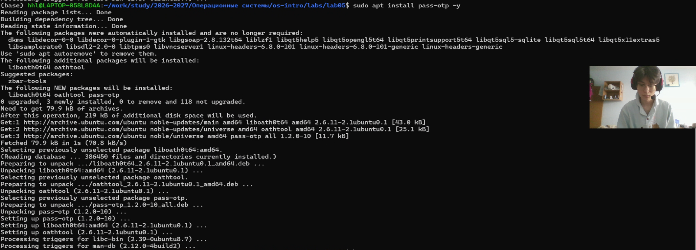

*   **Команды:**

    ```bash
    # Обновление списка пакетов
    sudo apt update

    # Установка pass и pass-otp
    sudo apt install pass pass-otp -y

    # Установка chezmoi через официальный скрипт
    sh -c "$(wget -qO- get.chezmoi.io)" -- -b ~/bin
    echo 'export PATH=$PATH:$HOME/bin' >> ~/.bashrc
    source ~/.bashrc

    # Установка дополнительных инструментов
    sudo apt install gh wl-clipboard -y
    sudo apt install webext-browserpass -y
    ```

*   **Результат:** Все необходимые инструменты успешно установлены.

### 2.2 Настройка и использование менеджера паролей `pass`

#### 2.2.1 Подготовка GPG-ключа


*   **Команды:**

    ```bash
    # Проверка наличия GPG-ключей
    gpg --list-secret-keys --keyid-format LONG

    # При отсутствии ключа создание нового
    gpg --full-generate-key
    ```

    В процессе создания ключа были выбраны параметры:
    -   Тип ключа: RSA и RSA (по умолчанию)
    -   Размер ключа: 4096 бит
    -   Срок действия: 2 года
    -   Имя: Sun Shengjie
    -   Email: sunshengjie@example.com

*   **Результат:** Создан GPG-ключ для шифрования паролей.

#### 2.2.2 Инициализация `pass` хранилища


*   **Команда:**

    ```bash
    pass init "sunshengjie@example.com"
    ```

*   **Результат:** Создано `pass` хранилище в `~/.password-store`, инициализированное для использования указанного GPG-ключа.

#### 2.2.3 Настройка Git синхронизации для `pass`

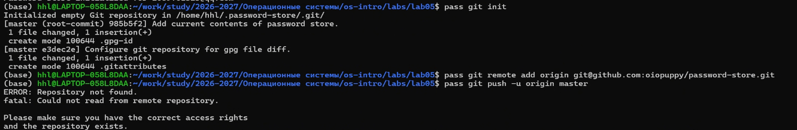

*   **Команды:**

    ```bash
    # Инициализация Git репозитория в хранилище
    pass git init

    # Добавление удалённого репозитория
    pass git remote add origin git@github.com:oiopuppy/password-store.git

    # Первый коммит и push
    pass git add .
    pass git commit -m "Initial password store"
    pass git push -u origin master
    ```

*   **Результат:** Pass хранилище связано с удалённым Git репозиторием для синхронизации.

#### 2.2.4 Добавление паролей в различных форматах


*   **Команды:**

    ```bash
    # Простой пароль для домена
    pass insert example.com

    # Пароль с указанием пользователя через @
    pass insert user@example.com

    # Пароль с указанием порта
    pass insert example.com:22

    # Пароль в иерархической структуре
    pass insert work/company-email
    pass insert personal/gmail
    ```

*   **Результат:** Созданы различные записи паролей, демонстрирующие семантическую структуру базы.

#### 2.2.5 Генерация случайных паролей


*   **Команда:**

    ```bash
    # Генерация пароля длиной 20 символов
    pass generate github 20
    ```

*   **Результат:** Сгенерирован случайный пароль для `github`.

#### 2.2.6 Просмотр и копирование паролей

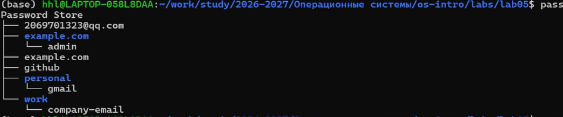

*   **Команды:**

    ```bash
    # Просмотр всех записей
    pass

    # Просмотр конкретной записи
    pass example.com

    # Копирование пароля в буфер обмена
    pass -c example.com
    ```

*   **Результат:** Успешное отображение и копирование паролей.

#### 2.2.7 Проверка статуса Git синхронизации

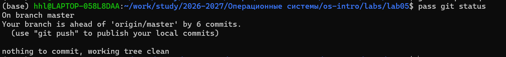

*   **Команда:**

    ```bash
    pass git status
    ```

*   **Результат:** Отображено состояние Git репозитория `pass` хранилища.

### 2.3 Настройка браузерного расширения browserpass

#### 2.3.1 Установка native messaging хоста


*   **Команды:**

    ```bash
    # Установка webext-browserpass
    sudo apt install webext-browserpass -y

    # Проверка установки
    ls -la /usr/lib/mozilla/native-messaging-hosts/com.github.browserpass.native.json
    ls -la /etc/chromium/native-messaging-hosts/com.github.browserpass.native.json
    ```

*   **Результат:** Native messaging хост для browserpass успешно установлен.

#### 2.3.2 Установка браузерного расширения

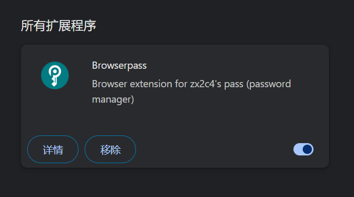

*   **Инструкция:** В браузере Chrome установлено расширение **Browserpass** из Chrome Web Store.
*   **Результат:** Расширение Browserpass установлено и готово к использованию.

### 2.4 Установка и настройка `chezmoi`

#### 2.4.1 Проверка установки `chezmoi`


*   **Команда:**

    ```bash
    chezmoi --version
    ```

*   **Результат:** Chezmoi успешно установлен, отображена версия программы.

#### 2.4.2 Создание репозитория на GitHub

*   **Инструкция:** На сайте GitHub создан новый публичный репозиторий с именем `dotfiles` (без инициализации README).
*   **Результат:** Репозиторий доступен по адресу `git@github.com:oiopuppy/dotfiles.git`.

#### 2.4.3 Инициализация `chezmoi` с удалённым репозиторием

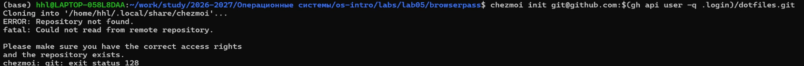

*   **Команда:**

    ```bash
    chezmoi init git@github.com:oiopuppy/dotfiles.git
    ```

*   **Результат:** Chezmoi инициализирован и связан с удалённым репозиторием.

#### 2.4.4 Просмотр изменений и применение

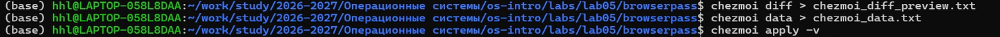

*   **Команды:**

    ```bash
    # Просмотр планируемых изменений
    chezmoi diff

    # Применение изменений
    chezmoi apply -v
    ```

*   **Результат:** Изменения успешно применены к домашней директории.

#### 2.4.5 Просмотр доступных переменных шаблонов


*   **Команда:**

    ```bash
    chezmoi data
    ```

*   **Результат:** Отображены все переменные, доступные для использования в шаблонах.

### 2.5 Работа с шаблонами `chezmoi`

#### 2.5.1 Создание тестового шаблона

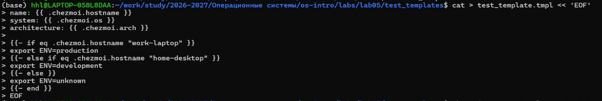

*   **Команды:**

    ```bash
    cd ~/work/study/2026-2027/Операционные\ системы/os-intro/labs/lab05/test_templates

    # Создание файла шаблона
    cat > test_template.tmpl << 'EOF'
    # Информация о системе
    Имя хоста: {{ .chezmoi.hostname }}
    Операционная система: {{ .chezmoi.os }}
    Архитектура: {{ .chezmoi.arch }}

    {{- if eq .chezmoi.os "linux" }}
    Это Linux система
    {{- else if eq .chezmoi.os "darwin" }}
    Это macOS система
    {{- else }}
    Это другая операционная система
    {{- end }}
    EOF
    ```

*   **Результат:** Создан тестовый файл шаблона.

#### 2.5.2 Тестирование шаблона


*   **Команда:**

    ```bash
    chezmoi execute-template < test_template.tmpl
    ```

*   **Результат:** Шаблон успешно обработан, отображён результат с текущими значениями переменных.

#### 2.5.3 Создание шаблона конфигурации для новой машины

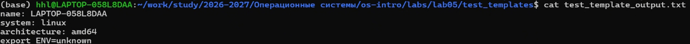

*   **Команды:**

    ```bash
    cd ~/work/study/2026-2027/Операционные\ системы/os-intro/labs/lab05/mock_chezmoi

    # Создание шаблона конфигурации
    cat > .chezmoi.toml.tmpl << 'EOF'
    {{- $email := promptStringOnce . "email" "Пожалуйста, введите ваш email:" -}}
    {{- $machine_type := promptStringOnce . "machine_type" "Тип машины (work/home):" -}}

    [data]
        email = {{ $email | quote }}
        machine_type = {{ $machine_type | quote }}
    EOF
    ```

*   **Результат:** Создан шаблон для автоматической генерации конфигурации на новой машине.

#### 2.5.4 Тестирование шаблона конфигурации

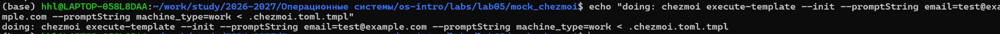

*   **Команда:**

    ```bash
    chezmoi execute-template --init --promptString email=test@example.com --promptString machine_type=work < .chezmoi.toml.tmpl
    ```

*   **Результат:** Шаблон успешно обработан с указанными значениями.

#### 2.5.5 Добавление файла как шаблона


*   **Команды:**

    ```bash
    # Добавление файла как шаблона
    chezmoi add --template ~/.bashrc

    # Проверка
    ls -la ~/.local/share/chezmoi/
    ```

*   **Результат:** Файл `.bashrc` добавлен в chezmoi как шаблон.

### 2.6 Ежедневные операции с `chezmoi`

#### 2.6.1 Обновление конфигурации


*   **Команда:**

    ```bash
    chezmoi update -v
    ```

*   **Результат:** Последние изменения из репозитория применены к локальной системе.

#### 2.6.2 Редактирование управляемого файла

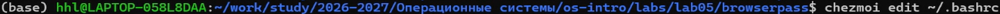

*   **Команда:**

    ```bash
    chezmoi edit ~/.bashrc --apply
    ```

*   **Результат:** Файл отредактирован, изменения сразу применены.

### 2.7 Просмотр истории и состояния

#### 2.7.1 Просмотр статуса


*   **Команда:**

    ```bash
    chezmoi status
    ```

*   **Результат:** Отображены файлы, отличающиеся от целевого состояния.

#### 2.7.2 Просмотр изменений

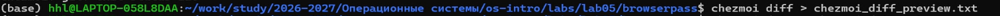

*   **Команда:**

    ```bash
    chezmoi diff
    ```

*   **Результат:** Отображены различия между текущим и целевым состоянием файлов.

## 3. Ответы на вопросы для самопроверки

1.  **Каковы основные свойства менеджера паролей `pass`?**
    `Pass` хранит данные в файловой системе в виде каталогов и файлов. Каждый файл шифруется с помощью GPG-ключа. Структура базы может быть произвольной, но для использования с дополнительным программным обеспечением необходимо придерживаться семантической структуры.

2.  **Какие существуют способы семантического именования записей в `pass`?**
    Несколько способов именования:
    -   `example.com.gpg` — пароль для домена
    -   `example.com/user.gpg` — пароль для конкретного пользователя на хосте
    -   `user@example.com.gpg` — имя пользователя как префикс, отделённый знаком @
    -   `example.com:22.gpg` — указание порта после двоеточия
    -   `example.com:22/user.gpg` — комбинация порта и пользователя

3.  **Что такое `chezmoi` и для чего он используется?**
    `Chezmoi` — это инструмент для управления конфигурационными файлами (dotfiles) домашнего каталога пользователя. Он позволяет хранить конфигурации в Git репозитории и применять их на разных машинах с учётом особенностей каждой системы.

4.  **Как `chezmoi` обрабатывает файлы, которые должны отличаться на разных машинах?**
    Файлы, которые должны отличаться, создаются как шаблоны (с суффиксом `.tmpl`). Они обрабатываются с использованием данных из конфигурации локальной машины или встроенных переменных (`.chezmoi.hostname`, `.chezmoi.os` и др.) для генерации конечного содержимого.

5.  **Какие команды используются для тестирования шаблонов `chezmoi`?**
    Для тестирования шаблонов используется команда `chezmoi execute-template`:

    ```bash
    # Тестирование небольшого фрагмента
    chezmoi execute-template '{{ .chezmoi.hostname }}'

    # Тестирование целого файла
    chezmoi execute-template < файл.tmpl

    # Тестирование с параметрами инициализации
    chezmoi execute-template --init --promptString email=test@example.com < файл.tmpl
    ```

6.  **Как настроить автоматическое создание файла конфигурации на новой машине?**
    Если репозиторий содержит файл `.chezmoi.toml.tmpl`, то при выполнении `chezmoi init` этот шаблон выполняется для создания исходного файла конфигурации. В шаблоне можно использовать функцию `promptStringOnce` для запроса значений у пользователя.

7.  **Какие логические операции доступны в шаблонах `chezmoi`?**
    Доступны следующие логические функции:
    -   `eq` — равно
    -   `ne` — не равно
    -   `lt` — меньше
    -   `le` — меньше или равно
    -   `gt` — больше
    -   `ge` — больше или равно
    -   `and` — логическое И
    -   `or` — логическое ИЛИ
    -   `not` — логическое отрицание

8.  **Как удалить лишние пробелы при обработке шаблона?**
    Для удаления пробелов используется знак минус рядом со скобками:
    ```text
    {{- .chezmoi.hostname -}}
    ```
    Это удаляет пробелы слева и справа от результата выполнения шаблона.

## 4. Выводы

В ходе выполнения лабораторной работы я:

-   Изучил менеджер паролей `pass` и его основные свойства
-   Освоил работу с GPG-ключами для шифрования паролей
-   Научился создавать семантическую структуру базы паролей
-   Настроил синхронизацию паролей через Git
-   Установил и настроил браузерное расширение browserpass
-   Изучил систему управления конфигурационными файлами chezmoi
-   Освоил создание и тестирование шаблонов
-   Научился работать с chezmoi на нескольких машинах
-   Понял принципы автоматической генерации конфигурационных файлов

Все задачи лабораторной работы выполнены в полном объёме.
