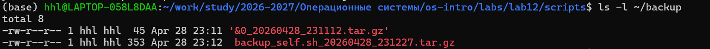
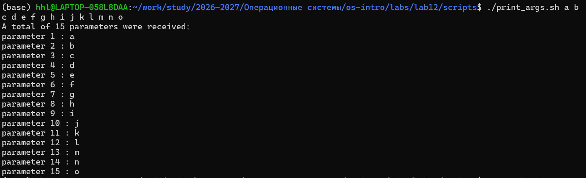
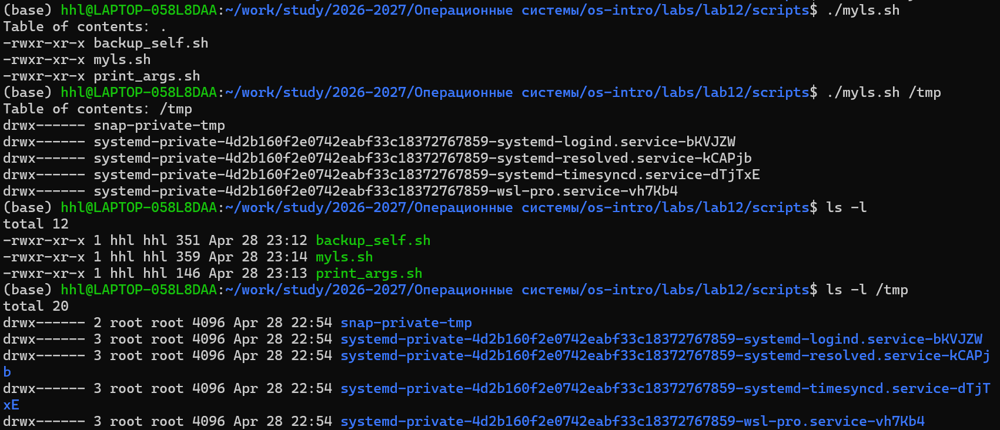
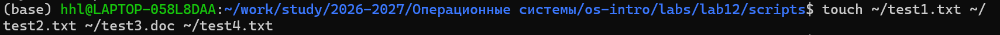
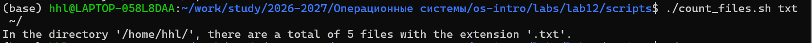

## Цель работы

- Освоить основы bash  
- Написание скриптов  
- Работа с аргументами  
- Имитация `ls`  
- Подсчёт файлов  

---

## Рабочий каталог

```
/home/hhl/work/study/2026-2027/Операционные системы/os-intro/labs/lab12/scripts
```

---

## Скрипт резервного копирования

```bash
#!/bin/bash
SCRIPT_PATH=$(realpath "$0")
SCRIPT_NAME=$(basename "$SCRIPT_PATH")

BACKUP_DIR="$HOME/backup"
mkdir -p "$BACKUP_DIR"

BACKUP_FILE="${BACKUP_DIR}/${SCRIPT_NAME}_$(date +%Y%m%d_%H%M%S).tar.gz"

tar -czf "$BACKUP_FILE" -C "$(dirname "$SCRIPT_PATH")" "$SCRIPT_NAME"
```

- Архивирует сам себя  
- Сохраняет в `~/backup`  

---

## Результат backup




---

## Обработка аргументов

```bash
#!/bin/bash
echo "Всего аргументов: $#"

for arg in "$@"; do
    echo "$arg"
done
```

- Использование `$@`  
- Поддержка любого числа аргументов  

---

## Результат аргументов



---

## Аналог команды ls

```bash
#!/bin/bash

for item in *; do
    perm=$(stat -c "%A" "$item")
    echo "$perm $item"
done
```

- Без `ls`  
- Используется `stat`  

---

## Сравнение с ls



---

## Подсчёт файлов

```bash
#!/bin/bash

count=$(find "$2" -maxdepth 1 -type f -name "*$1" | wc -l)
echo "$count"
```

- Используется `find`  
- Подсчёт по расширению  

---

## Тестирование

```bash
touch ~/test1.txt ~/test2.txt ~/test3.doc
./count_files.sh .txt ~/
```





---

## Контрольные вопросы

- Shell — интерфейс ОС  
- POSIX — стандарт  
- Переменные: `var=1`  
- Аргументы: `$1`, `$@`  
- Метасимволы: `* ? |`  

---

## Выводы

- Освоен bash  
- Созданы 4 скрипта  
- Автоматизация задач  
- Работа с файлами  

---

## Спасибо за внимание!
