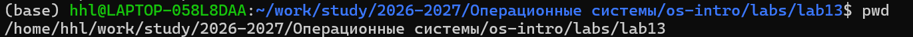
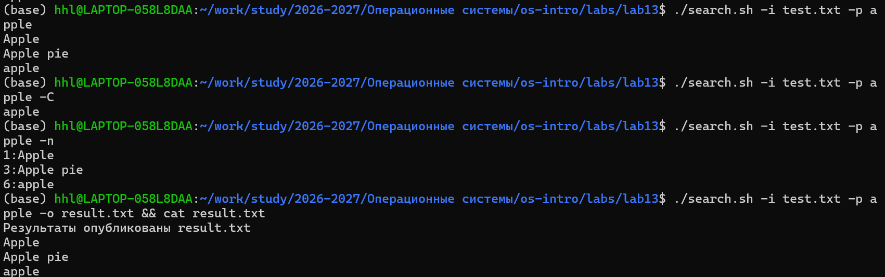

## Цель работы

- Изучение bash-программирования  
- Освоение ветвлений и циклов  
- Работа с файлами и архивами  
- Анализ аргументов и кодов возврата  

---

## Подготовка среды

    cd /home/.../lab13
    mkdir -p task_files
    cd task_files

---

## Задание 1: getopts

- Разбор аргументов командной строки  
- Ключи:  
  - -i входной файл  
  - -o выходной файл  
  - -p шаблон  
  - -C регистр  
  - -n номера строк  

---

## Скрипт search.sh

    #!/bin/bash
    while getopts "i:o:p:Cn" opt; do
        case $opt in
            i) input="$OPTARG" ;;
            o) output="$OPTARG" ;;
            p) pattern="$OPTARG" ;;
            C) case="-C" ;;
            n) num="-n" ;;
        esac
    done

---

## Результаты search.sh

    echo -e "Apple\nbanana\nApple pie\nBANANA\nOrange\napple" > test.txt

    ./search.sh -i test.txt -p apple
    ./search.sh -i test.txt -p apple -C
    ./search.sh -i test.txt -p apple -n

---

## Задание 2: C + $?

Программа:

    if (num > 0) exit(1);
    else if (num < 0) exit(2);
    else exit(0);

---

## Скрипт анализа

    ./check_number
    code=$?

    case $code in
        0) echo "Ноль" ;;
        1) echo "Положительное" ;;
        2) echo "Отрицательное" ;;
    esac

---

## Задание 3: файлы

    for i in $(seq 1 N); do
        touch "$i.tmp"
    done

Удаление:

    rm -f "$i.tmp"

---

## Задание 4: архив

    find . -mtime -7 > list.txt
    tar -cf backup.tar -T list.txt

---

## Заключение

Освоены:

- getopts  
- $?  
- циклы и условия  
- работа с файлами  
- tar + find  

---

## Ответы

- getopts — разбор аргументов  
- Метасимволы — шаблоны файлов  

Операторы:

    && || ; & | () {}

Циклы:

    break, continue, exit

- true/false — коды возврата  
- test -f — проверка файла  

while vs until:

    while — пока true
    until — пока false
