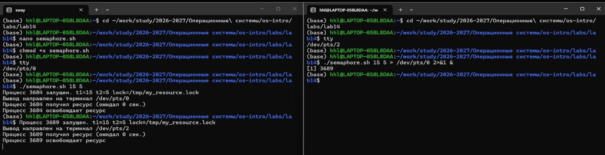
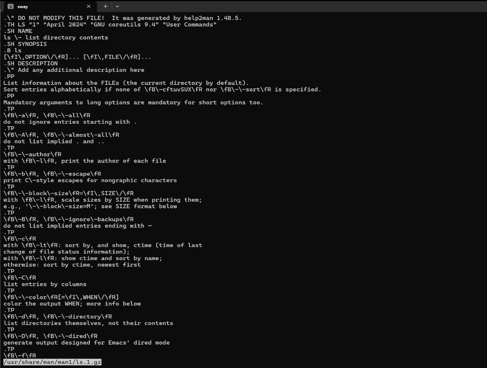
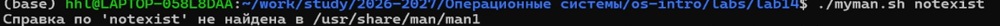
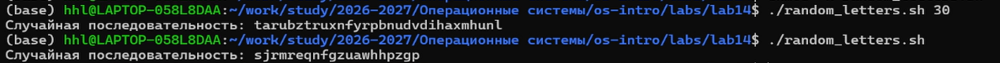

## Цель работы

- Изучить программирование в оболочке UNIX
- Освоить ветвления и циклы
- Реализовать упрощённый механизм семафоров
- Создать аналог команды man
- Научиться генерировать случайные последовательности

---

## Задание 1: Упрощённый механизм семафоров

### Постановка задачи

Разработать командный файл:

- ожидающий освобождения ресурса в течение времени `t1`
- использующий ресурс в течение времени `t2`
- реализующий блокировку через `mkdir`

---

## semaphore.sh

```bash
#!/bin/bash

t1=${1:-10}
t2=${2:-3}
lockfile=${3:-/tmp/my_resource.lock}

echo "Процесс $$ запущен. t1=$t1 t2=$t2 lock=$lockfile"

waited=0

while [ $waited -lt $t1 ]; do
    if mkdir "$lockfile" 2>/dev/null; then
        echo "Процесс $$ получил ресурс (ожидал $waited сек.)"

        sleep $t2

        echo "Процесс $$ освобождает ресурс"
        rmdir "$lockfile"

        exit 0
    fi

    echo "Процесс $$ ожидает освобождения ресурса... ($waited/$t1)"

    sleep 1
    waited=$((waited+1))
done

echo "Процесс $$ не дождался ресурса за $t1 сек."
exit 1
```

---

## Запуск semaphore.sh

### Терминал 1

```bash
tty
/dev/pts/1

./semaphore.sh 15 5
```

Вывод:

```text
Процесс 1234 запущен. t1=15 t2=5 lock=/tmp/my_resource.lock
Процесс 1234 получил ресурс (ожидал 0 сек.)
Процесс 1234 освобождает ресурс
```

---

## Терминал 2

```bash
tty
/dev/pts/2

./semaphore.sh 15 5 > /dev/pts/1 2>&1 &
```

Вывод:

```text
[1] 1235
```

---

## Результат работы семафора

- процессы корректно ожидают освобождения ресурса
- используется атомарная операция `mkdir`
- обеспечивается взаимное исключение



---

## Задание 2: Реализация команды man

### Постановка задачи

Создать упрощённую версию команды `man`:

- принимать имя команды
- искать справку в `/usr/share/man/man1`
- выводить содержимое через `zless`

---

## myman.sh

```bash
#!/bin/bash

if [ $# -ne 1 ]; then
    echo "Использование: $0 команда"
    exit 1
fi

manpage="/usr/share/man/man1/${1}.1.gz"

if [ -f "$manpage" ]; then
    zless "$manpage"
else
    echo "Справка по '$1' не найдена в /usr/share/man/man1"
    exit 1
fi
```

---

## Тестирование myman.sh

### Существующая команда

```bash
./myman.sh ls
```

Результат:

- отображается справка по команде `ls`



---

## Несуществующая команда

```bash
./myman.sh nonexistent_command
```

Вывод:

```text
Справка по 'nonexistent_command' не найдена в /usr/share/man/man1
```



---

## Задание 3: Генератор случайных последовательностей

### Постановка задачи

Создать командный файл:

- генерирующий случайные буквы
- использующий `$RANDOM`
- поддерживающий длину строки через аргумент

---

## random_letters.sh

```bash
#!/bin/bash

length=${1:-20}

letters="abcdefghijklmnopqrstuvwxyz"
result=""

for ((i=0; i<length; i++)); do
    idx=$((RANDOM % 26))
    result="${result}${letters:idx:1}"
done

echo "Случайная последовательность: $result"
```

---

## Тестирование random_letters.sh

### Стандартный запуск

```bash
./random_letters.sh
```

Вывод:

```text
Случайная последовательность: kxmzowpqrbvcnthgejdsa
```

---

## Генерация 30 символов

```bash
./random_letters.sh 30
```

Вывод:

```text
Случайная последовательность: plmoknijbuhvygctfxrdzeswaqlmn
```



---

## Контрольные вопросы

### 1. Ошибка в while

Неверно:

```bash
1 while [$1 != "exit"]
```

Верно:

```bash
while [ "$1" != "exit" ]
```

---

## 2. Конкатенация строк

```bash
str="Hello"
str2="World"

result="$str $str2"
result="${str}${str2}"
```

---

## 3. Аналоги seq

- `echo {1..10}`
- цикл `for`
- цикл `while`

Пример:

```bash
for ((i=1; i<=10; i++)); do
    echo $i
done
```

---

## 4. Результат вычисления

```bash
$((10 / 3))
```

Результат:

```text
3
```

---

## 5. Отличия zsh от bash

- улучшенное автодополнение
- расширенные glob-шаблоны
- массивы с индексацией от 1
- более гибкая настройка интерфейса

---

## 6. Ошибка в for

Неверно:

```bash
for ((a=1; a <= LIMIT; a++)
```

Верно:

```bash
for ((a=1; a <= LIMIT; a++)); do
    команды
done
```

---

## 7. Bash: преимущества и недостатки

| Преимущества | Недостатки |
|---|---|
| Автоматизация задач | Медленная работа |
| Не требует компиляции | Сложный синтаксис |
| Есть в любой Linux-системе | Слабые структуры данных |
| Удобная работа с ОС | Ограниченная отладка |

---

## Выводы

В ходе работы были изучены:

- циклы и условия
- bash-скрипты
- работа с `$RANDOM`
- перенаправление ввода-вывода
- реализация семафоров через `mkdir`
- создание аналога команды `man`

Полученные навыки позволяют создавать более сложные сценарии автоматизации UNIX.

---

# Спасибо за внимание!
