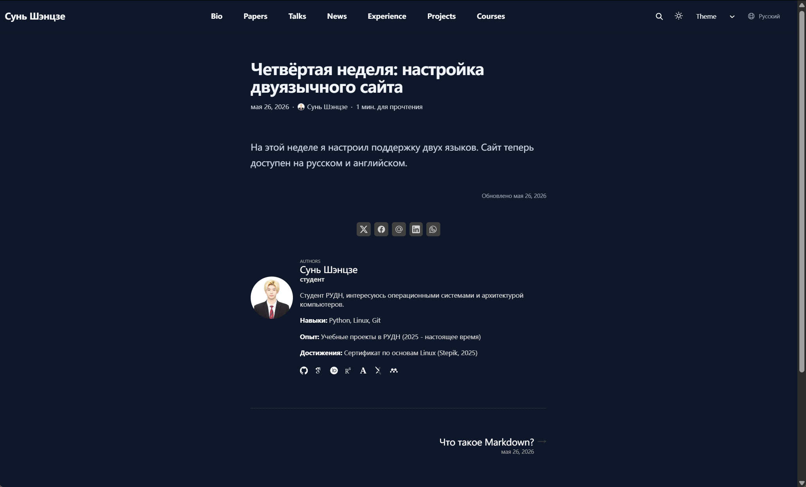
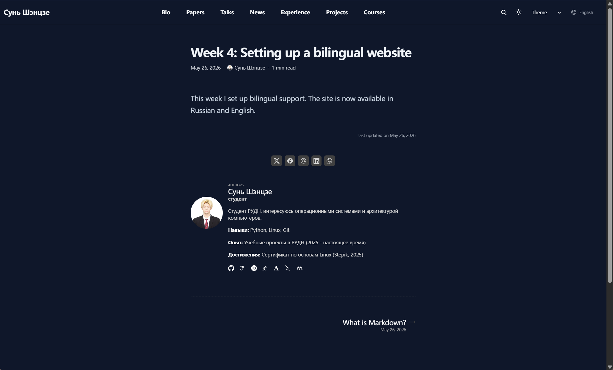

## Цель работы

- Настроить двуязычный сайт
- Добавить русский и английский языки
- Создать посты на двух языках
- Обновить структуру проекта

---

## Настройка языков

Файл `config/_default/languages.yaml`:

```yaml
ru:
  languageCode: ru-RU
  languageName: Русский
  contentDir: content/ru

en:
  languageCode: en-US
  languageName: English
  contentDir: content/en
```

---

## Структура каталогов

Созданы каталоги:

```text
content/
├── ru/
│   ├── blog/
│   ├── project/
│   └── authors/
└── en/
    ├── blog/
    ├── project/
    └── authors/
```

---

## Авторская информация

Файл:

```text
content/en/authors/me/_index.md
```

Пример:

```markdown
title: "Sun Shengjie"
role: "student"
bio: "RUDN student interested in OS and architecture."
```

---

## Пост о прошедшей неделе

Созданы две версии поста:

```text
content/ru/blog/week4-bilingual/
content/en/blog/week4-bilingual/
```

Русская версия:

```markdown
На этой неделе я настроил поддержку двух языков.
```

---

## Тематический пост

Созданы посты о Markdown:

```text
content/ru/blog/markdown-bilingual/
content/en/blog/markdown-bilingual/
```

Тематика:

- Markdown
- Разметка текста
- Работа с Hugo

---

## Русская версия сайта



---

## Английская версия сайта



---

## Результаты работы

В ходе проекта:

- Настроены два языка
- Создан мультиязычный контент
- Переведена информация об авторе
- Добавлены новые посты

---

## Ссылка на сайт

```text
https://oiopuppy.github.io
```

---

# Спасибо за внимание!
