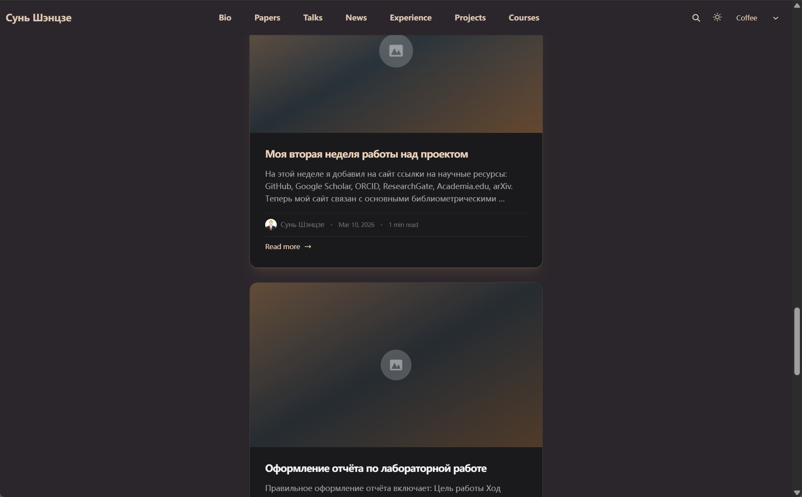
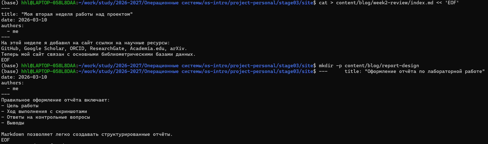

## Цель проекта

- Развитие личного сайта  
- Интеграция научных сервисов  
- Публикация материалов  

---

## Используемые ресурсы

- Google Scholar  
- ORCID  
- ResearchGate  
- Academia.edu  
- arXiv  
- GitHub  
- eLibrary  
- Mendeley  

---

## Интеграция ссылок

links:
  - GitHub: https://github.com/oiopuppy  
  - Google Scholar: https://scholar.google.com/  
  - ORCID: https://orcid.org/  
  - ResearchGate: https://www.researchgate.net/  
  - Academia.edu: https://www.academia.edu/  
  - arXiv: https://arxiv.org/

---

## Результат интеграции

- Ссылки добавлены в профиль  
- Подключены научные платформы  
- Обновлена структура сайта  

---

## Пост 1: неделя работы

Файл: week2-review  

- Регистрация на научных платформах  
- Добавление ссылок на сайт  
- Отражение прогресса проекта  

---

## Результат поста 1

---

## Пост 2: оформление отчёта

Файл: report-design  

- Структура лабораторного отчёта  
- Описание этапов работы  
- Требования к оформлению  

---

## Результат поста 2

---

## Итоги проекта

- Настроен личный сайт  
- Добавлены научные профили  
- Созданы публикации  
- Проект опубликован  

---

## Заключение

Проект успешно реализован и готов к дальнейшему развитию.
