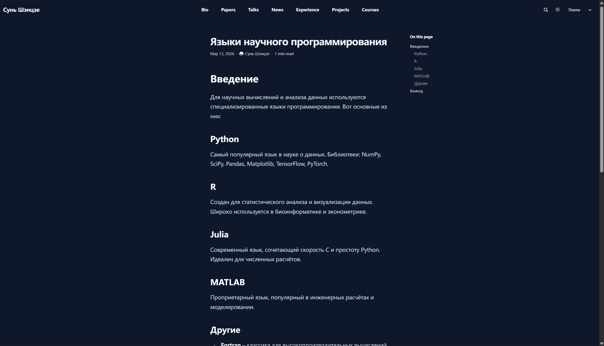

## Цель работы

- Добавить раздел проектов
- Создать пост о прошедшей неделе
- Создать пост о языках научного программирования

---

## Персональные проекты

Создан файл:

```text
content/project/personal-site/index.md
```

### Содержание проекта

- Hugo
- GitHub Pages
- Markdown
- Academic Theme


---

## Описание проекта

```markdown
## О проекте

Персональный академический сайт,
созданный на Hugo и размещённый
на GitHub Pages.
```

### Используемые технологии

- Hugo Extended
- Git / GitHub
- YAML

---

## Пост о прошедшей неделе

Создан файл:

```text
content/blog/week3-review/index.md
```

### Основное содержание

- добавлены проекты
- создан новый блог-пост
- улучшена структура сайта


---

## Языки научного программирования

Создан файл:

```text
content/blog/scientific-programming-languages/index.md
```



---

## Python

### Особенности

- анализ данных
- машинное обучение
- научные вычисления

### Библиотеки

```text
NumPy
SciPy
Pandas
Matplotlib
```

---

## R и Julia

### R

- статистика
- визуализация данных

### Julia

- высокая скорость
- удобный синтаксис

---

## MATLAB

### Использование

- инженерные расчёты
- моделирование
- математика

### Особенность

Сочетание вычислений и визуализации.

---

## Выводы

В ходе работы:

- добавлен раздел проектов
- создан блог о прошедшей неделе
- опубликован пост о научных языках

Сайт опубликован на GitHub Pages.

---

# Спасибо за внимание!
