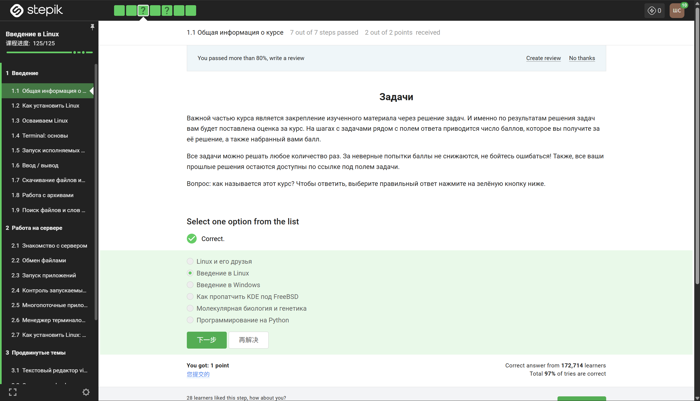
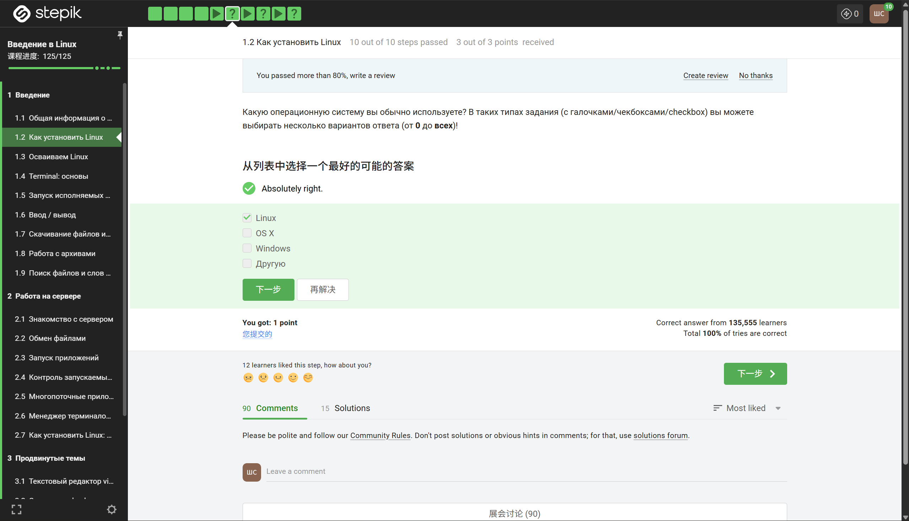
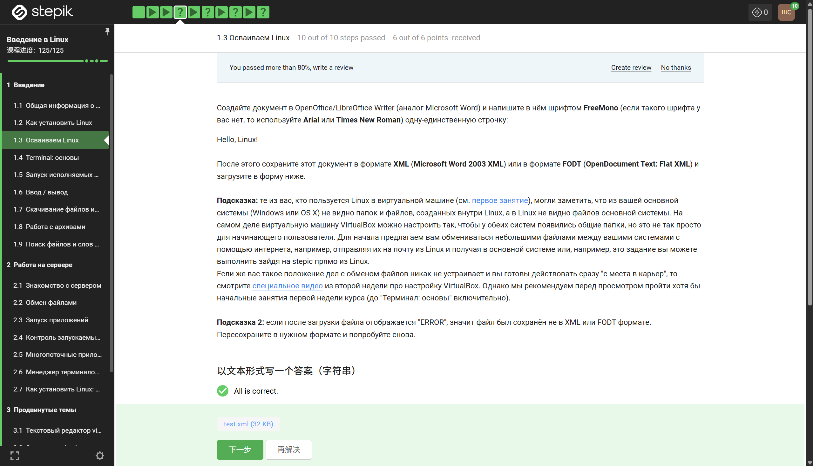
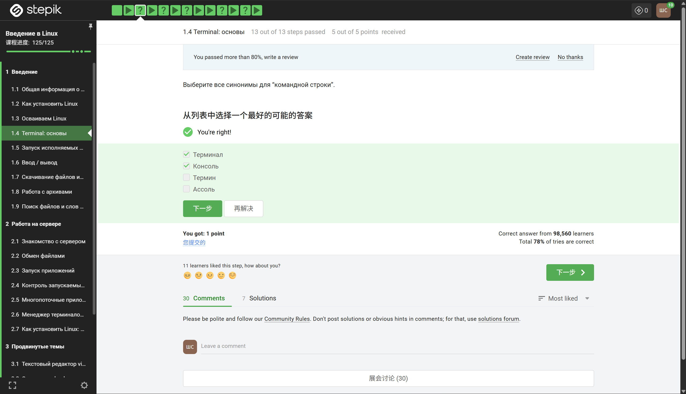
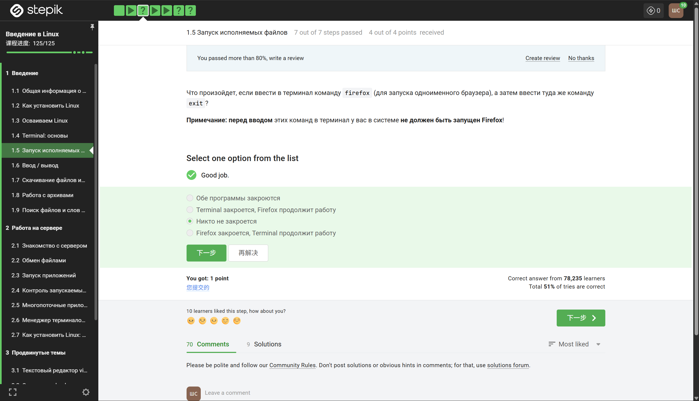
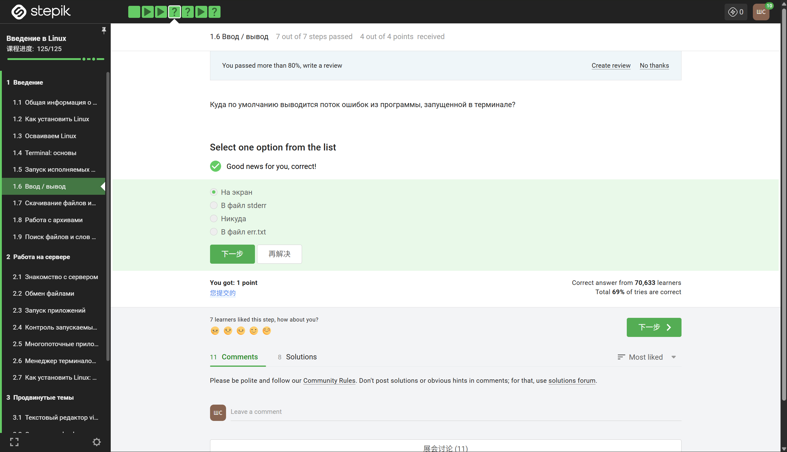
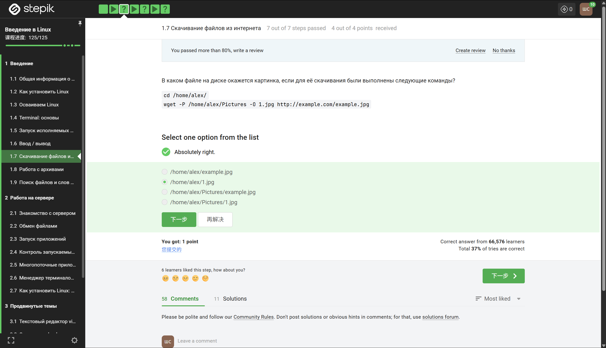
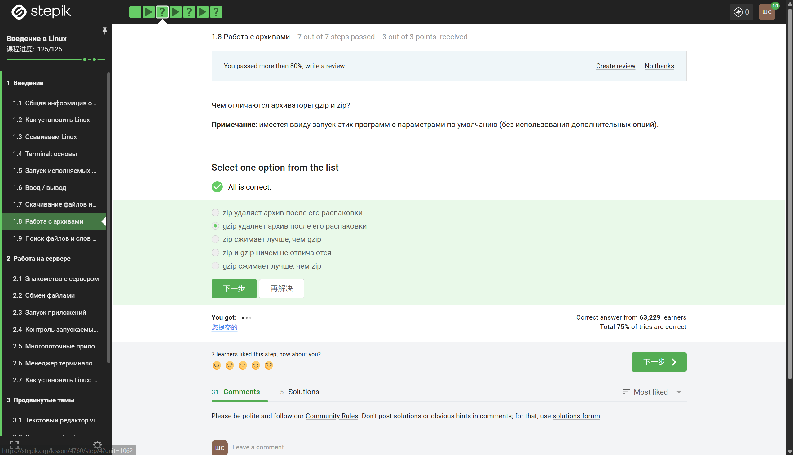
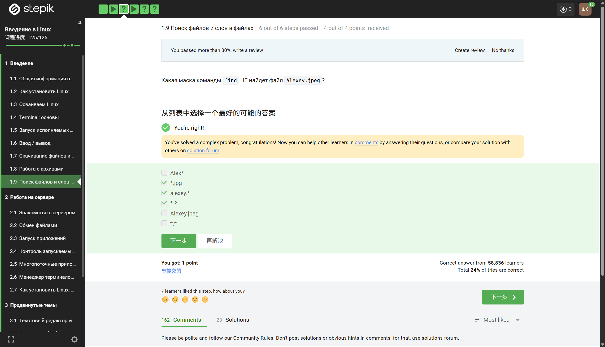

## Введение

В рамках первой главы курса были изучены фундаментальные аспекты работы с операционной системой Linux. Данная глава заложила базу для дальнейшего более глубокого освоения материала, включая управление процессами, настройку окружения и автоматизацию задач. В данном отчёте кратко изложены основные темы и приобретённые навыки.

## 1. Установка и первое знакомство с Linux

На начальном этапе было рассмотрено, как установить Linux. Был изучен процесс создания загрузочной флешки, разметки диска и выбора дистрибутива. В ходе выполнения практических заданий были опробованы различные способы установки, в том числе на виртуальную машину. Это позволило получить представление о том, как происходит настройка системы "с нуля" и какие параметры важно учитывать при первоначальной конфигурации.

## 2. Освоение терминала и базовых команд

Ключевой частью первой главы стало знакомство с терминалом. Было установлено, что терминал — это основной инструмент для эффективного взаимодействия с Linux. В ходе изучения были освоены команды для навигации по файловой системе (`cd`, `ls`, `pwd`), создания и удаления файлов и директорий (`touch`, `mkdir`, `rm`, `rmdir`), а также для просмотра содержимого файлов (`cat`, `less`, `head`, `tail`). Отдельное внимание уделялось работе с правами доступа и использованием символьных ссылок.

## 3. Запуск исполняемых файлов и управление процессами

В разделе о запуске исполняемых файлов были рассмотрены переменные окружения, в частности `PATH`. Было выяснено, как система ищет исполняемые файлы и как можно запустить программу, указав полный или относительный путь. Также были изучены способы управления процессами, такие как запуск в фоновом режиме с помощью символа `&`, приостановка процесса (`Ctrl+Z`) и возвращение к нему командами `fg` и `bg`.

## 4. Перенаправление ввода-вывода (I/O redirection)

Тема перенаправления ввода-вывода оказалась крайне полезной на практике. Было освоено перенаправление стандартного вывода в файл с помощью `>` и `>>`, а также перенаправление ошибок через `2>`. Конвейеры (`|`) были изучены как мощный инструмент для объединения нескольких команд, где вывод предыдущей программы становится вводом для следующей. Это позволило эффективно обрабатывать текстовые данные и логи без использования промежуточных файлов.

## 5. Скачивание файлов из интернета

В ходе работы с темой загрузки файлов были освоены утилиты `wget` и `curl`. Выяснены ключевые различия между ними: `wget` удобен для рекурсивного скачивания и работы по HTTP/HTTPS/FTP, тогда как `curl` лучше подходит для взаимодействия с API и поддерживает большее количество протоколов. На практике были выполнены задания по скачиванию архивов, веб-страниц и файлов с аутентификацией.

## 6. Работа с архивами

Важной темой стало сжатие и архивация данных. Были изучены основные алгоритмы сжатия (gzip, bzip2, xz) и работа с архиватором `tar`. Были рассмотрены ключевые опции: `-c` (создание архива), `-x` (распаковка), `-v` (подробный вывод), `-f` (указание файла). Также было уделено внимание форматам `.zip` через утилиту `zip`/`unzip`. Полученные навыки позволяют эффективно управлять резервными копиями и дистрибутивами программного обеспечения.

## 7. Поиск файлов и слов в файлах

Для поиска информации в файловой системе были освоены команды `find` и `grep`. Команда `find` была изучена как средство гибкого поиска файлов по различным критериям: имени (с использованием масок), размеру, времени изменения, типу. В свою очередь, `grep` был освоен для поиска текстовых строк внутри файлов с поддержкой регулярных выражений. Совместное использование этих утилит через конвейеры открывает широкие возможности для анализа логов и кода.

## Заключение

Первая глава курса позволила приобрести уверенные начальные навыки работы с Linux. Несмотря на кажущуюся простоту, рассмотренные темы — от установки системы до поиска файлов — являются критически важными для любого специалиста в области информационных технологий. Освоенный материал служит фундаментом для дальнейшего изучения более сложных разделов, таких как написание скриптов на Bash, настройка серверов и управление пакетами. В ходе выполнения всех заданий было сформировано понимание философии Linux: "всё есть файл" и мощь комбинирования простых утилит для решения комплексных задач.
