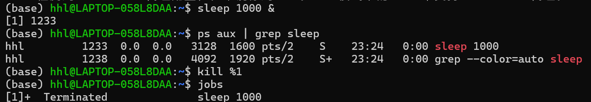
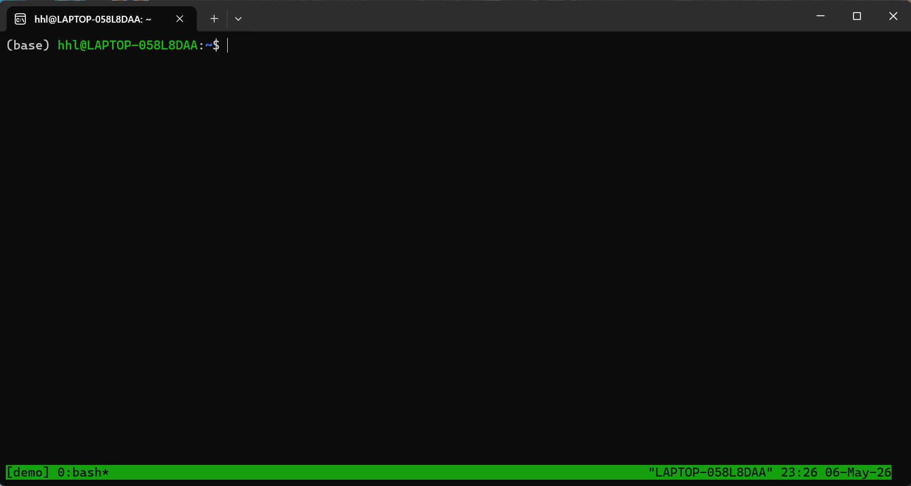

## Цель главы

- Знакомство с удалённым сервером
- Обмен файлами (scp, rsync, sftp)
- Запуск приложений на сервере
- Контроль запущенных программ
- Многопоточные приложения
- Менеджер терминалов tmux

---

## Подключение к серверу (SSH)

```bash
ssh user@server.com
ssh -p 2222 user@server.com
ssh -i ~/.ssh/key.pem user@server.com
ssh user@server.com "ls -la /home"
```

---

## Проверка состояния сервера

```bash
uname -a
who
uptime
df -h
free -h
```

---

## Обмен файлами: scp

```bash
scp file.txt user@server.com:/path/
scp user@server.com:/path/file.txt ./
scp -r folder/ user@server.com:/path/
```

---

## Обмен файлами: rsync

```bash
rsync -avz folder/ user@server.com:/path/
rsync -avz --progress folder/ user@server.com:/path/
rsync -avz user@server.com:/path/ ./
```


---

## Обмен файлами: sftp

```bash
sftp user@server.com
ls
cd /path
get file.txt
put local.txt
bye
```

---

## Запуск приложений

```bash
./long_task.sh
./long_task.sh &
jobs
fg
bg
```

---

## nohup (защита процесса)

```bash
nohup ./long_task.sh > output.log 2>&1 &
```

---

## Приоритеты процессов

```bash
nice -n 19 ./heavy_task.sh
nice -n -20 ./critical_task.sh
renice -n 10 -p 1234
```

| nice | Приоритет |
|------|----------|
| -20  | высокий  |
| 0    | стандарт |
| 19   | низкий   |

---

## Контроль процессов

```bash
ps aux
ps aux | grep python
top
htop
```

---

## Управление процессами

```bash
kill PID
kill -9 PID
pkill name
killall name
```

| Сигнал  | №  | Значение              |
|---------|----|----------------------|
| SIGTERM | 15 | корректное завершение |
| SIGKILL | 9  | принудительное       |
| SIGHUP  | 1  | перезагрузка         |
| SIGINT  | 2  | Ctrl+C               |

---

## Пример процессов



```bash
sleep 1000 &
ps aux | grep sleep
kill 12345
jobs
```

---

## Параллельная обработка

```bash
find . -name "*.jpg" | xargs -P 4 -I {} convert {} -resize 50% {}

parallel "gzip {}" ::: *.log
```

---

## Параллельные задачи (bash)

```bash
for i in {1..4}; do
    ./task.sh $i &
done
wait
echo "Готово"
```

---

## Ограничение потоков

```bash
export OPENBLAS_NUM_THREADS=4
export MKL_NUM_THREADS=4
export OMP_NUM_THREADS=4
```

---

## tmux: основные команды

| Действие | Команда |
|----------|--------|
| Новая сессия | tmux new -s name |
| Отключиться | Ctrl+B, d |
| Подключиться | tmux attach -t name |
| Список | tmux ls |
| Удалить | tmux kill-session -t name |

---

## tmux: разделение

| Действие | Клавиши |
|----------|--------|
| Горизонтально | Ctrl+B, " |
| Вертикально   | Ctrl+B, % |
| Перемещение   | Ctrl+B + стрелки |
| Закрыть       | Ctrl+B, x |

---

## tmux: пример



```bash
tmux new -s mysession
# Ctrl+B, " 
# Ctrl+B, %
# Ctrl+B + стрелки
Ctrl+B, d
tmux attach -t mysession
```

---

## Важно про fg

```bash
fg
# Работает только в той же сессии
```

---

## Контрольные вопросы

- SSH с портом?
- Разница scp и rsync?
- Что без nohup?
- Сигналы?
- 4 параллельные задачи?
- tmux создать/выйти?
- fg в другой вкладке?

---

## Выводы

- Освоен SSH  
- Изучены scp / rsync / sftp  
- Работа с фоновыми процессами  
- Управление приоритетами  
- Контроль процессов  
- Параллельные вычисления  
- Освоен tmux  

---

## Спасибо за внимание
