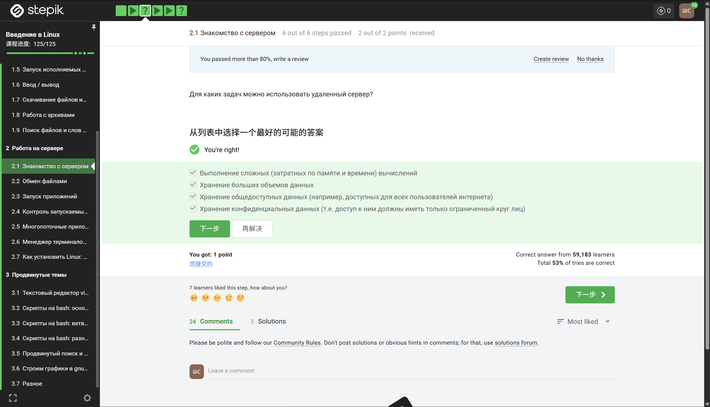
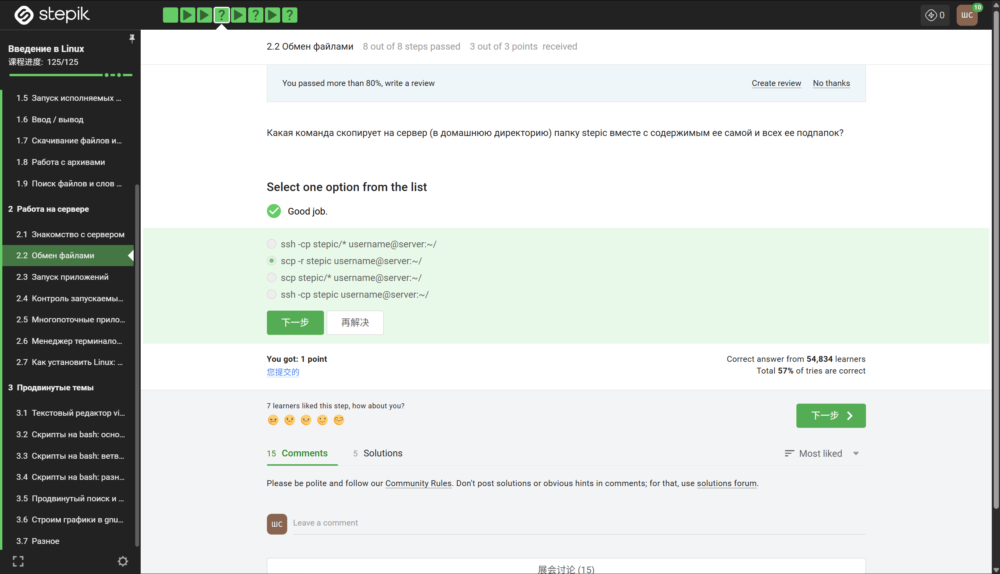
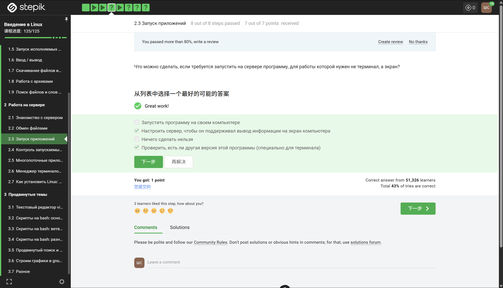
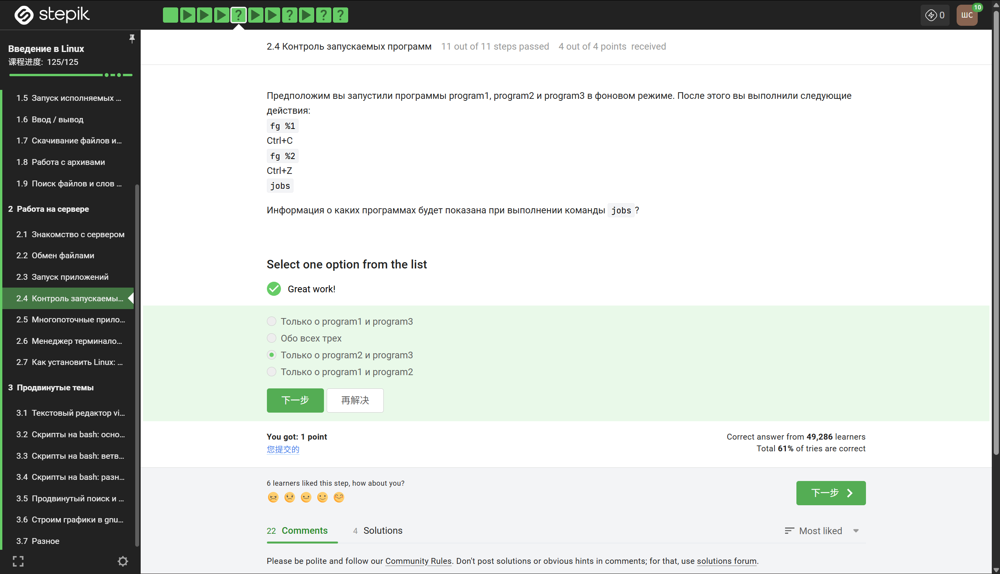
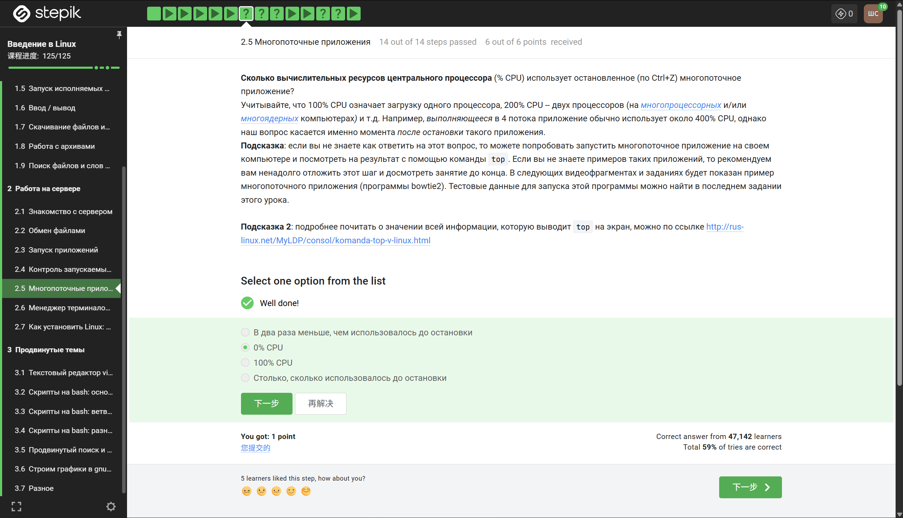
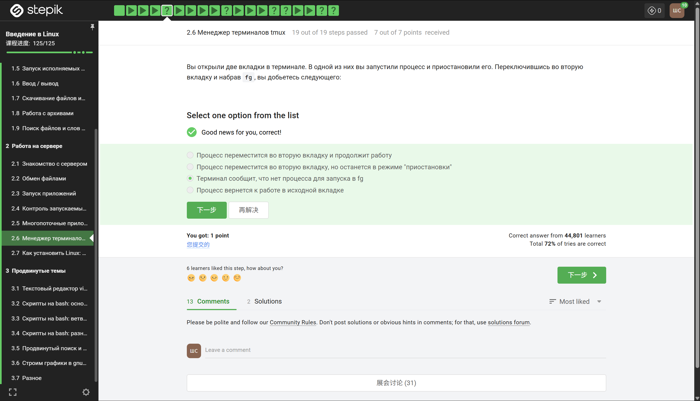

## Введение

Вторая глава курса посвящена практической работе на удалённом сервере. В отличие от локальной машины, сервер требует понимания сетевых протоколов, безопасности, управления процессами и многопользовательской среды. В рамках данной главы были изучены ключевые аспекты взаимодействия с сервером: от первого подключения до запуска многопоточных приложений и эффективного управления терминальными сессиями. Данный отчёт суммирует полученные знания и навыки.

## 1. Знакомство с сервером

На первом этапе было освоено подключение к удалённому серверу по протоколу SSH. Были изучены основные параметры команды `ssh`, включая указание порта (`-p`), использование ключей для аутентификации (`-i`) и запуск единичных команд без интерактивной сессии. Также было рассмотрено, как копировать файлы на сервер и с сервера с помощью `scp` и `rsync`. Отдельное внимание уделялось базовым командам для получения информации о системе: `uname`, `who`, `uptime`, `df`, `free`. Эти команды позволяют быстро оценить состояние сервера перед началом работы.

## 2. Обмен файлами

Раздел об обмене файлами расширил понимание способов передачи данных между локальной машиной и сервером. Помимо уже знакомого `scp`, были изучены более продвинутые инструменты:

- **`rsync`** — для эффективной синхронизации файлов с возможностью сжатия, инкрементального копирования и сохранения прав доступа.
- **`sftp`** — интерактивная сессия для работы с файлами на сервере, напоминающая FTP, но работающая через SSH.
- **`mc`** (Midnight Commander) — псевдографический файловый менеджер, удобный для двухпанельного обмена файлами прямо в терминале.

На практике было выполнено несколько сценариев: резервное копирование локальных данных на сервер, синхронизация папки проекта и загрузка файлов с сервера по расписанию с использованием `cron`.

## 3. Запуск приложений

В этой теме было рассмотрено, как запускать приложения на сервере в различных режимах. Ключевые аспекты включают:

- **Обычный запуск** — приложение привязано к текущей терминальной сессии.
- **Фоновый запуск** — с помощью символа `&` или команд `bg` / `fg`.
- **Отвязка от терминала** — использование `nohup` для запуска процессов, которые не завершатся при закрытии SSH.
- **Запуск с изменённым окружением** — передача переменных окружения, перенаправление ввода-вывода.

Также были изучены способы проверки работающих приложений (`ps`, `top`, `htop`) и приоритезация процессов через `nice` и `renice`. Это особенно важно на shared-серверах, где ресурсы ограничены.

## 4. Контроль запускаемых программ

Раздел о контроле запущенных программ посвящён мониторингу и управлению процессами в реальном времени. Были освоены следующие утилиты и техники:

- **`ps aux`** — детальный список всех процессов с их PID, состоянием, потреблением CPU и памяти.
- **`top` / `htop`** — интерактивные мониторы с возможностью сортировки, поиска и отправки сигналов процессам.
- **`kill` / `pkill` / `killall`** — отправка сигналов (SIGTERM, SIGKILL, SIGHUP) для остановки, перезагрузки или перечитывания конфигурации процессов.
- **`systemctl`** — управление сервисами (демонами), если сервер использует systemd.

Также были рассмотрены логи: просмотр системных логов через `journalctl` (для systemd) или файлов в `/var/log/`. Это позволяет диагностировать почему процесс завершился аварийно или не может запуститься.

## 5. Многопоточные приложения

Важный раздел, посвящённый использованию многоядерных серверов. Было выяснено, как:

- **Запускать несколько потоков одного приложения** — большинство современных утилит поддерживают флаг `-j` или `--threads`.
- **Ограничивать количество потоков** — с помощью переменных окружения (`OMP_NUM_THREADS`, `OPENBLAS_NUM_THREADS`) или параметров запуска.
- **Параллелить независимые задачи** — используя `xargs -P`, `parallel`, или фоновый запуск нескольких процессов с последующей синхронизацией через `wait`.

Практическим заданием был запуск вычислительной задачи (например, сжатие нескольких файлов или обработка изображений) сначала в один поток, затем в несколько, с замером времени выполнения через `time`. Разница в производительности оказалась значительной при правильном использовании доступных ядер.

## 6. Менеджер терминалов tmux

Финальная и, пожалуй, самая практически полезная тема — оконный менеджер для терминала `tmux`. Было изучено:

- **Создание сессий** — `tmux new -s имя`.
- **Отключение от сессии** (`Ctrl+B, d`) и повторное подключение (`tmux attach -t имя`).
- **Горизонтальное разделение окна** на панели (`Ctrl+B, "`).
- **Вертикальное разделение окна** (`Ctrl+B, %`).
- **Навигация между панелями** — `Ctrl+B` и стрелки.
- **Закрытие панели** — `Ctrl+B, x` или команда `exit` внутри панели.
- **Создание новых окон** внутри сессии (`Ctrl+B, c`) и переключение между ними (`Ctrl+B, номера` или `Ctrl+B, n/p`).

Особенно ценной оказалась возможность запускать долгие процессы (например, обучение модели или сборку проекта) внутри `tmux` на сервере, отключиться от SSH, а затем вернуться и увидеть тот же результат. Это избавляет от необходимости держать SSH-соединение открытым.

## Заключение

Вторая глава кардинально расширила практические навыки работы с Linux-серверами. Было освоено: подключение по SSH, гибкая передача файлов, управление процессами, контроль над запущенными приложениями, параллельное выполнение задач и, наконец, управление терминальными сессиями через `tmux`. Полученные компетенции являются основой для работы в роли системного администратора, разработчика или DevOps-инженера. Отдельно стоит отметить, что все изученные инструменты являются стандартными для большинства Linux-серверов и не требуют установки дополнительного ПО, что делает эти навыки универсальными.
