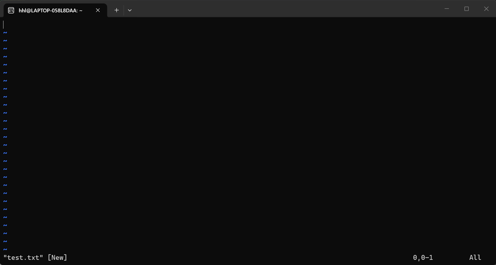
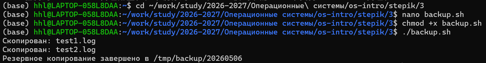
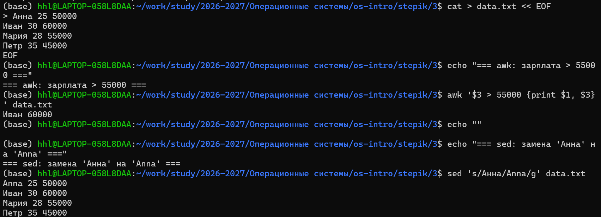
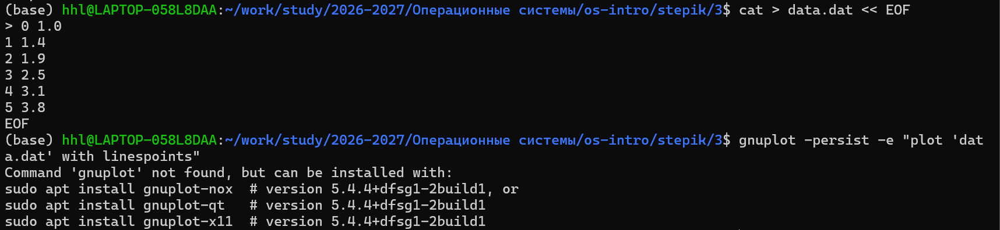

## Цель главы

- vim: режимы и быстрые операции  
- Bash: ветвления, циклы, функции  
- Поиск: find, grep, sed, awk  
- Визуализация: gnuplot  
- Автоматизация задач  

---

## vim: режимы

| Режим   | Назначение            | Вход |
|--------|----------------------|------|
| Normal | Навигация, команды   | Esc  |
| Insert | Ввод текста          | i a o |
| Visual | Выделение            | v V Ctrl+V |
| Cmd    | :w :q :help          | :    |

---

## vim: навигация

```vim
h j k l
w e b
0 $
gg G
Ctrl+F / Ctrl+B
```

---

## word vs WORD

- **word** → буквы/цифры/_  
- **WORD** → любые непробельные  

Пример:  
`Strange_ TEXT is_here. 2=2 YES!`

- w → больше шагов  
- W → быстрее по строке  

---

## vim: редактирование

```vim
x dd dw
yy yw
p P
u Ctrl+R .
```

---

## vim: поиск и замена

```vim
/pattern
?pattern
n N
:%s/old/new/g
:s/old/new/g
```



---

## Bash: основы

```bash
#!/bin/bash
name="World"
echo "Hello, $name"

echo $1
echo $@
echo $#
```

---

## Ввод и условия

```bash
read -p "Имя: " user

[ -f file ]
[ -d dir ]
[ "$a" = "$b" ]
[ -z "$s" ]
```

---

## if / case

```bash
if [ -f "$1" ]; then
  echo "file"
elif [ -d "$1" ]; then
  echo "dir"
else
  echo "none"
fi
```

```bash
case "$1" in
 start) echo run ;;
 stop) echo stop ;;
 *) echo usage ;;
esac
```

---

## Циклы

```bash
for f in *.txt; do
  wc -l "$f"
done
```

```bash
while [ $i -le 5 ]; do
  ((i++))
done
```

---

## Функции и массивы

```bash
greet() { echo "Hi $1"; }
greet "Anna"
```

```bash
arr=(a b c)
echo ${arr[@]}
echo ${#arr[@]}
```

---

## Пример скрипта

```bash
backup="/backup/$(date +%Y%m%d)"
mkdir -p "$backup"

for f in *.log; do
  cp "$f" "$backup/"
done
```



---

## find

```bash
find . -name "*.txt"
find . -size +10M
find . -mtime -7
```

```bash
find . -name "*.log" -delete
```

---

## grep

```bash
grep "error" file
grep -r "TODO" .
grep -i "warn" *.log
```

```bash
grep -E "error|fatal"
```

---

## sed

```bash
sed 's/a/b/g' file
sed '/pattern/d'
sed -n '1,5p'
```

---

## awk

```bash
awk '{print $1, $3}'
awk '$3 > 100'
awk '{sum+=$2} END {print sum}'
```



---

## gnuplot: базово

```bash
plot "data.dat" with linespoints
```

```bash
set title "Graph"
set xlabel "X"
set ylabel "Y"
```

---

## gnuplot: экспорт

```bash
set terminal png
set output "graph.png"
plot "data.dat" with lines
```



---

## Автоматизация

```bash
gnuplot << EOF
plot "data.dat" with lines
EOF
```

---

## Полезные команды

```bash
find . -name "*.log" | xargs rm
time ./script.sh
alias ll='ls -la'
```

---

## Контрольные вопросы

- Разница w / W?  
- for по *.txt?  
- find >100MB?  
- sed замена?  
- awk сумма?  
- gnuplot PNG?  
- xargs -P?  

---

## Выводы

- Освоен vim  
- Bash-скрипты  
- find / grep / sed / awk  
- gnuplot  
- Автоматизация  

---

## Спасибо за внимание
