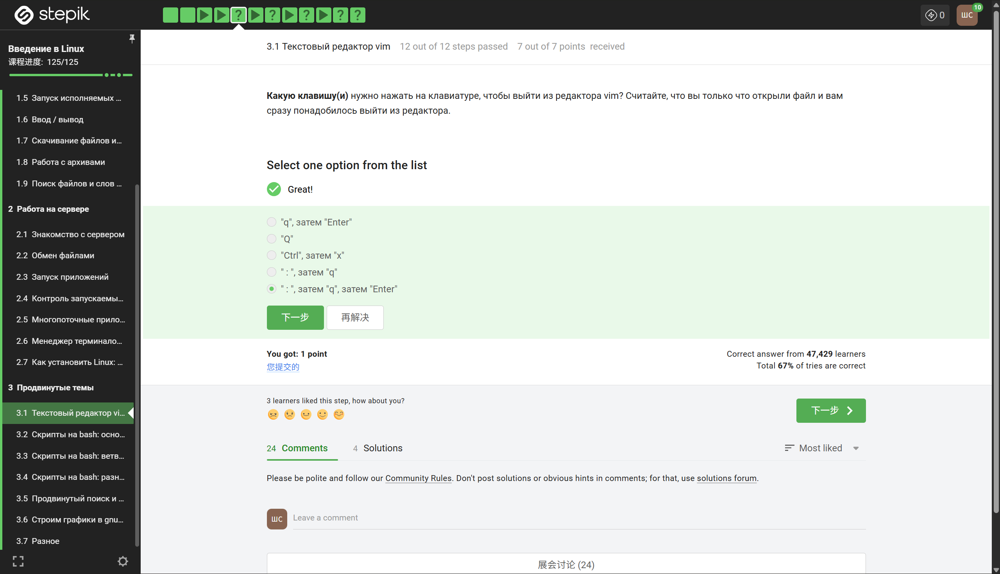
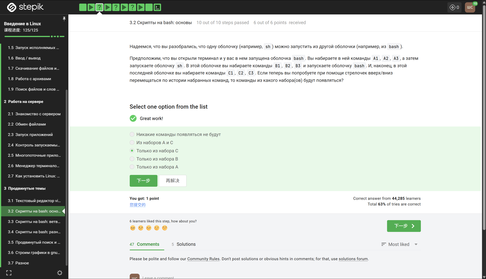
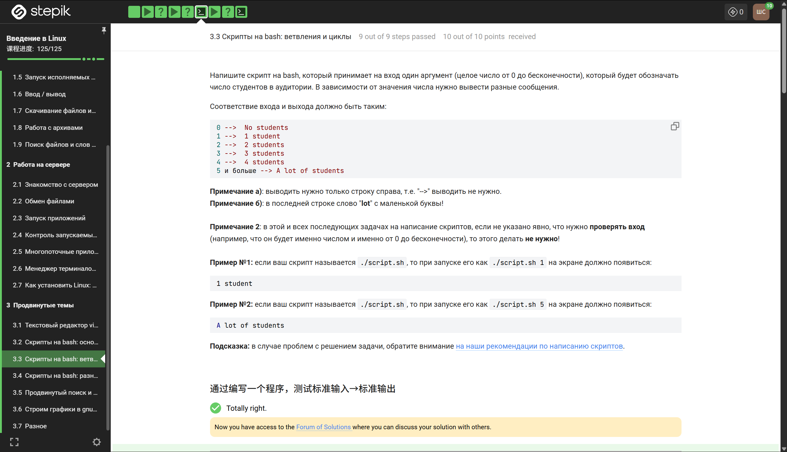
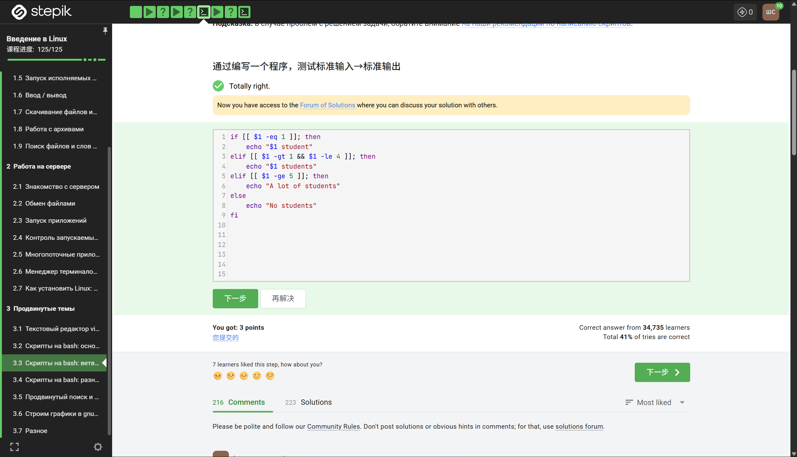

## Введение

Третья глава курса посвящена продвинутым темам, которые существенно расширяют возможности работы в Linux. В отличие от предыдущих глав, здесь акцент смещается с базового администрирования на эффективную обработку текстов, автоматизацию задач с помощью скриптов, визуализацию данных и работу с мощными инструментами, такими как vim и gnuplot. Данный отчёт суммирует все ключевые навыки, приобретённые в рамках этой главы.

## 1. Текстовый редактор vim



Первой и одной из самых важных тем стал редактор vim. В отличие от обычных текстовых редакторов, vim имеет модальный интерфейс, что требует привыкания, но в дальнейшем позволяет редактировать текст с невероятной скоростью. Были изучены следующие режимы и команды:

### Режимы vim

- **Нормальный режим (Normal)** — для навигации и манипуляций с текстом.
- **Режим вставки (Insert)** — для непосредственного ввода текста (вход через `i`, `a`, `o`).
- **Визуальный режим (Visual)** — для выделения блоков текста (вход через `v`, `V`, `Ctrl+V`).
- **Командный режим (Command-line)** — для выполнения команд `:w`, `:q`, `:help` и других.

### Навигация

Были освоены эффективные способы перемещения по тексту:

- **По словам**: `w`, `e`, `b` и `W`, `E`, `B`.
- **По строкам**: `0`, `$`, `^`.
- **По экрану**: `Ctrl+F`, `Ctrl+B`, `H`, `M`, `L`.
- **По документу**: `gg`, `G`, `:n`.

### Редактирование

- **Удаление**: `x`, `dw`, `dd`, `d$`.
- **Копирование и вставка**: `yy`, `yw`, `p`, `P`.
- **Отмена и повтор**: `u`, `Ctrl+R`, `.`.
- **Поиск и замена**: `/pattern`, `?pattern`, `n`, `N`, `:%s/old/new/g`.

### Разница между word и WORD

**word** — буквы, цифры, подчёркивания.  
**WORD** — любые непробельные символы.

## 2. Скрипты на bash: основы



- **Shebang**: `#!/bin/bash`
- **Переменные**: `name="value"`
- **Ввод**: `read var`
- **Аргументы**: `$1`, `$#`, `$@`, `$0`
- **Арифметика**: `$((a+b))`
- **Условия**: `[ -f file ]`
- **Код возврата**: `$?`

### Пример скрипта

```
#!/bin/bash
echo "Привет, $1!"
echo "Сегодня: $(date)"

if [ -f "$2" ]; then
    echo "Файл $2 существует"
else
    echo "Файл $2 не найден"
fi
```

## 3. Скрипты: ветвления и циклы




### Ветвления

```
if [ условие ]; then
    команды
elif [ условие ]; then
    команды
else
    команды
fi
```

```
case $var in
  start) echo "Запуск";;
  stop) echo "Стоп";;
  *) echo "Ошибка";;
esac
```

### Циклы

```
for file in *.txt; do
  echo $file
done
```

```
while [ $i -le 10 ]; do
  echo $i
  ((i++))
done
```

## 4. Bash: дополнительно

### Функции

```
greet() {
  echo "Hello $1"
}
```

### Массивы

```
arr=(1 2 3)
echo ${arr[0]}
```

### Here-doc

```
cat << EOF
text
EOF
```

### Отладка

```
bash -x script.sh
```

### Trap

```
trap 'echo stop' INT
```

## 5. find, grep, sed, awk

### find

- `-mtime`, `-size`, `-exec`

### grep

- `-r`, `-i`, `-n`

### sed

```
sed 's/a/b/g'
```

### awk

```
awk '{print $1}'
```

## 6. Gnuplot

### Пример

```
set terminal png
set output "graph.png"
plot "data.txt" with lines
```

## 7. Разное

### xargs

```
find . | xargs rm
```

### time

```
time ./a.out
```

### alias

```
alias ll='ls -la'
```

### history

- `!!`, `!100`

### сигналы

- SIGTERM  
- SIGKILL  
- SIGINT  

## Заключение

Третья глава курса стала важным этапом перехода к продвинутому уровню. Были освоены vim, bash, обработка данных и визуализация через gnuplot. Эти навыки применимы в реальной работе и позволяют эффективно автоматизировать задачи и работать с Linux на профессиональном уровне.
